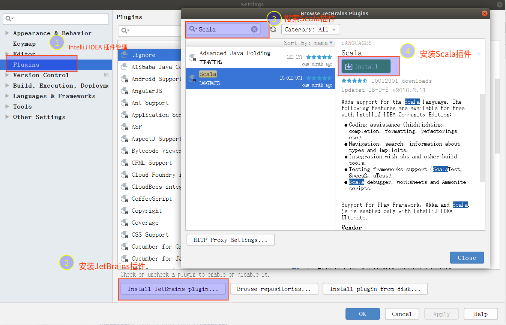
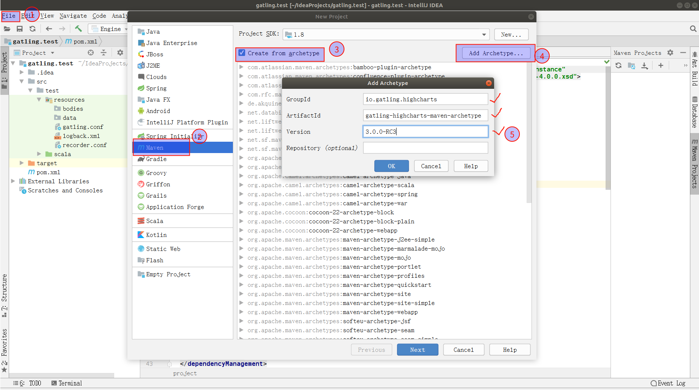
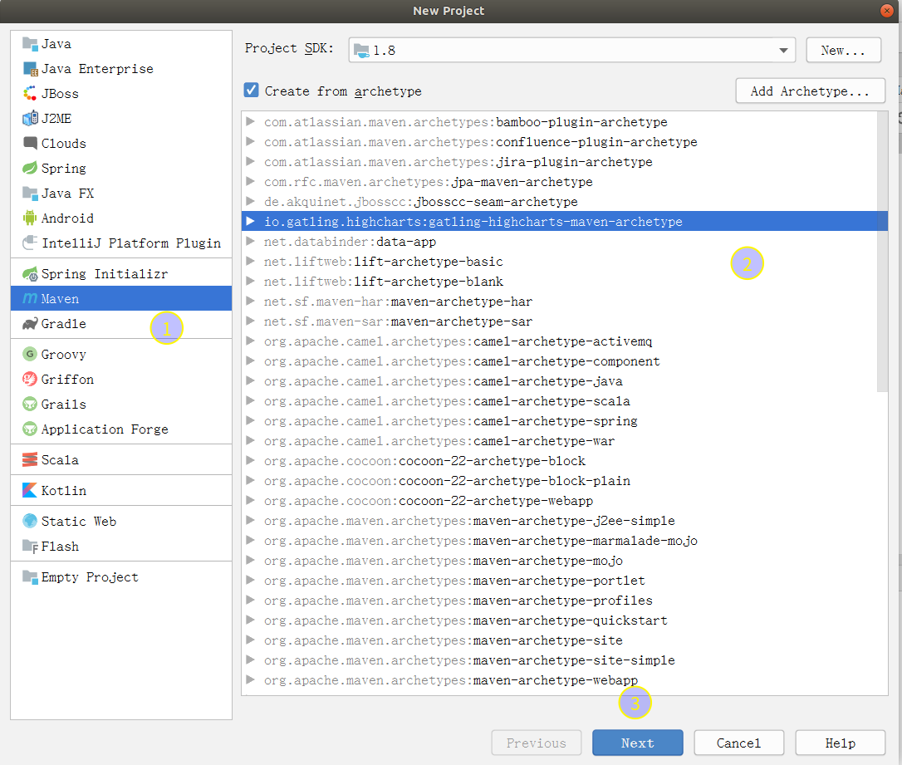
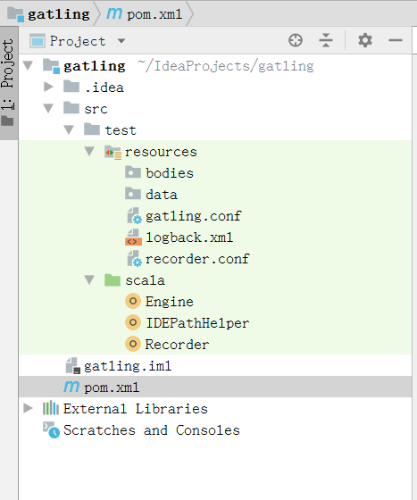
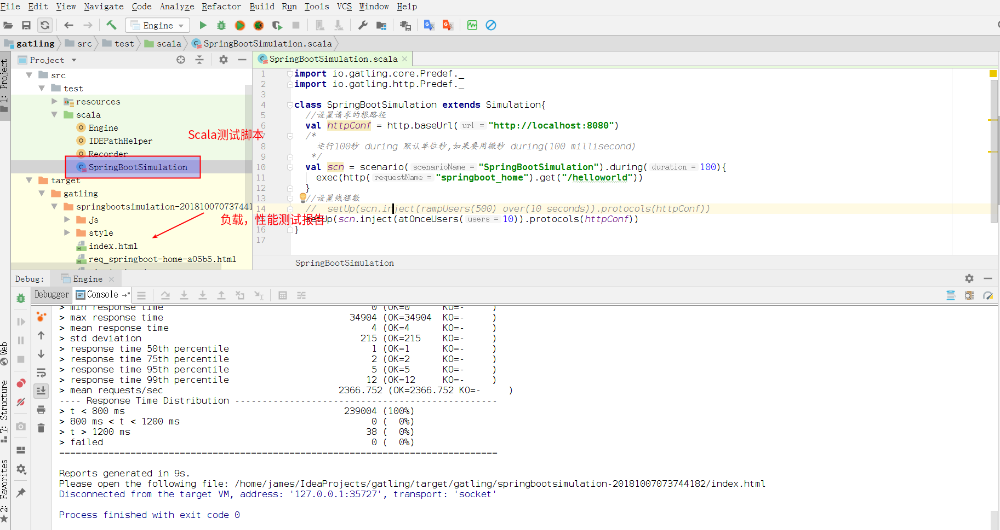
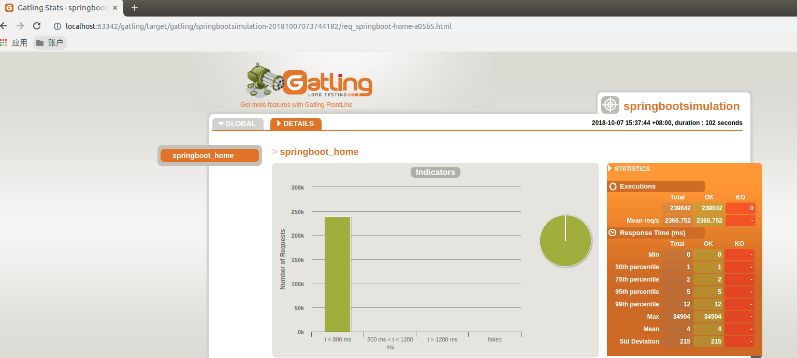
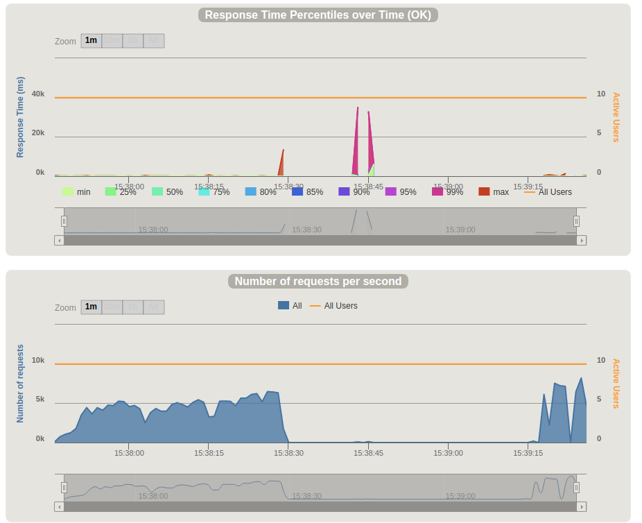

## 前言

Gatling是一款基于Scala 开发的高性能服务器性能测试工具，它主要用于对服务器进行负载等测试，并分析和测量服务器的各种性能指标。目前仅支持http协议，可以用来测试web应用程序和RESTful服务。

除此之外它拥有以下特点：/home/james/IdeaProjects/note/source/_posts/Gatling简单测试SpringBoot工程/新建Gatling Maven工程.png

- 支持Akka Actors 和 Async IO，从而能达到很高的性能
- 支持实时生成Html动态轻量报表，从而使报表更易阅读和进行数据分析
- 支持DSL脚本，从而使测试脚本更易开发与维护
- 支持录制并生成测试脚本，从而可以方便的生成测试脚本
- 支持导入HAR（Http Archive）并生成测试脚本
- 支持Maven，Eclipse，IntelliJ等，以便于开发
- 支持Jenkins，以便于进行持续集成
- 支持插件，从而可以扩展其功能，比如可以扩展对其他协议的支持
- 开源免费


<!-- more -->

## 依赖工具

- Maven
- JDK
- Intellij IDEA


## 安装Scala插件

打开 IDEA ，点击【IntelliJ IDEA】 -> 【Preferences】 -> 【Plugins】，搜索 “Scala”，搜索到插件然后点击底部的 【Install JetBrains plugin…】安装重启即可。



## Gatling Maven工程

创建Gatling提供的**gatling-highcharts-maven-archetype**,

在 IntelliJ中选择 `New Project` -> `Maven` -> `Create form archetype` -> `Add Archetype`，在弹出框中输入一下内容：

```
GroupId: io.gatling.highcharts
ArtifactId: gatling-highcharts-maven-archetype
Version: 3.0.0-RC3
```

点击查看最新版本: [最新版本](https://search.maven.org/search?q=g:io.gatling.highcharts%20AND%20a:gatling-highcharts-maven-archetype&core=gav)

之后输入你项目的GroupId(包名)和ArtifactId(项目名)来完成项目创建，

项目创建完成后，Maven会自动配置项目结构。





注:在创建的工程，修改**pom.xml**文件，添加如下配置,加快构建速度:

```
<repositories>
    <repository>
      <id>public</id>
      <name>aliyun nexus</name>
      <url>http://maven.aliyun.com/nexus/content/groups/public/</url>
      <releases>
        <enabled>true</enabled>
      </releases>
    </repository>
  </repositories>
  <pluginRepositories>
    <pluginRepository>
      <id>public</id>
      <name>aliyun nexus</name>
      <url>http://maven.aliyun.com/nexus/content/groups/public/</url>
      <releases>
        <enabled>true</enabled>
      </releases>
      <snapshots>
        <enabled>false</enabled>
      </snapshots>
    </pluginRepository>
  </pluginRepositories>
```

### 工程项目目录

工程项目结构如下图：



项目目录说明：

- bodies：用来存放请求的body数据
- data：存放需要输入的数据
- scala：存放Simulation脚本
- Engine：右键运行跟运行 `bin\gatling.bat` 和`bin\gatling.sh`效果一致
- Recorder：右键运行跟运行 `bin\recorder.bat` 和`bin\recorder.sh`效果一致，录制的脚本存放在scala目录下
- target：存放运行后的报告

至此就可以使用IntelliJ愉快的开发啦。


## Gatling测试SpringBoot

Gatling基于Scala开发的压测工具，我们可以通过录制自动生成脚本，也可以自己编写脚本，大家不用担心，首先脚本很简单常用的没几个，另外gatling封装的也很好我们不需要去专门学习Scala语法，当然如果会的话会更好。

### SpringBoot测试工程示例

#### Maven依赖

代码如下

```
 <parent>
        <groupId>org.springframework.boot</groupId>
        <artifactId>spring-boot-starter-parent</artifactId>
        <version>2.0.5.RELEASE</version>
        <relativePath/> <!-- lookup parent from repository -->
    </parent>

    <properties>
        <project.build.sourceEncoding>UTF-8</project.build.sourceEncoding>
        <project.reporting.outputEncoding>UTF-8</project.reporting.outputEncoding>
        <java.version>1.8</java.version>
    </properties>

    <dependencies>
        <dependency>
            <groupId>org.springframework.boot</groupId>
            <artifactId>spring-boot-starter-web</artifactId>
        </dependency>

        <dependency>
            <groupId>org.springframework.boot</groupId>
            <artifactId>spring-boot-starter-test</artifactId>
            <scope>test</scope>
        </dependency>
    </dependencies>
```

#### 控制层接口

代码如下:

```
@RestController
public class HelloWorldController {
    @RequestMapping("/helloworld")
    public String sayHelloWorld(){
        return "hello World !";
    }
}
```

#### 浏览器演示


### Gatling测试脚本编写

Gatling基于Scala开发的压测工具，我们可以通过录制自动生成脚本，也可以自己编写脚本，大家不用担心，首先脚本很简单常用的没几个，另外gatling封装的也很好我们不需要去专门学习Scala语法，当然如果会的话会更好。

#### 脚本示例

```
import io.gatling.core.Predef._
import io.gatling.http.Predef._

class SpringBootSimulation extends Simulation{
  //设置请求的根路径
  val httpConf = http.baseUrl("http://localhost:8080")
  /*
    运行100秒 during 默认单位秒,如果要用微秒 during(100 millisecond)
   */
  val scn = scenario("SpringBootSimulation").during(100){
    exec(http("springboot_home").get("/helloworld"))
  }
  //设置线程数
  //  setUp(scn.inject(rampUsers(500) over(10 seconds)).protocols(httpConf))
  setUp(scn.inject(atOnceUsers(10)).protocols(httpConf))
}
```

#### 脚本编写



Gatling脚本的编写主要包含下面三个步骤

- http head配置
- Scenario 执行细节
- setUp 组装

我们以百度为例，进行第一个GET请求测试脚本的编写，类必须继承 Simulation

1. 配置下head，只是简单的请求下百度首页，所以只定义下请求的base url，采用默认的http配置即可

   ```
   //设置请求的根路径
   val httpConf = http.baseURL("http://localhost:8080")
   ```

2. 声明Scenario，指定我们的请求动作

   ```
   val scn = scenario("SpringBootSimulation").during(100){
       exec(http("springboot_home").get("/helloworld"))
     }
   ```

   scenario里的参数：scenario name
   exec()里的参数就是我们的执行动作，http(“本次请求的名称”).get(“本次http get请求的地址”)

3. 设置并发数并组装

   ```
   //设置线程数
   setUp(scn.inject(atOnceUsers(10)).protocols(httpConf))
   ```

   atOnceUsers：立马启动的用户数，可以理解为并发数

这样我们一个简单的脚本就完成了，可以运行看下效果。

部分测试报告如下:






### 高级教程

#### Injection – 注入

注入方法用来定义虚拟用户的操作

```
setUp(
  scn.inject(
    nothingFor(4 seconds), // 1
    atOnceUsers(10), // 2
    rampUsers(10) over(5 seconds), // 3
    constantUsersPerSec(20) during(15 seconds), // 4
    constantUsersPerSec(20) during(15 seconds) randomized, // 5
    rampUsersPerSec(10) to 20 during(10 minutes), // 6
    rampUsersPerSec(10) to 20 during(10 minutes) randomized, // 7
    splitUsers(1000) into(rampUsers(10) over(10 seconds)) separatedBy(10 seconds), // 8
    splitUsers(1000) into(rampUsers(10) over(10 seconds)) separatedBy atOnceUsers(30), // 9
    heavisideUsers(1000) over(20 seconds) // 10
  ).protocols(httpConf)
)
```


1. nothingFor(duration)：设置一段停止的时间

2. atOnceUsers(nbUsers)：立即注入一定数量的虚拟用户

   ```
   setUp(scn.inject(atOnceUsers(50)).protocols(httpConf))
   ```

3. rampUsers(nbUsers) over(duration)：在指定时间内，设置一定数量逐步注入的虚拟用户

   ```
   setUp(scn.inject(rampUsers(50) over(30 seconds)).protocols(httpConf))
   ```

4. constantUsersPerSec(rate) during(duration)：定义一个在每秒钟恒定的并发用户数，持续指定的时间

   ```
   setUp(scn.inject(constantUsersPerSec(30) during(15 seconds)).protocols(httpConf))
   ```

5. constantUsersPerSec(rate) during(duration) randomized：定义一个在每秒钟围绕指定并发数随机增减的并发，持续指定时间

   ```
   setUp(scn.inject(constantUsersPerSec(30) during(15 seconds) randomized).protocols(httpConf))
   ```

6. rampUsersPerSec(rate1) to (rate2) during(duration)：定义一个并发数区间，运行指定时间，并发增长的周期是一个规律的值

   ```
   setUp(scn.inject(rampUsersPerSec(30) to (50) during(15 seconds)).protocols(httpConf))
   ```

7. rampUsersPerSec(rate1) to(rate2) during(duration) randomized：定义一个并发数区间，运行指定时间，并发增长的周期是一个随机的值

   ```
   setUp(scn.inject(rampUsersPerSec(30) to (50) during(15 seconds) randomized).protocols(httpConf))
   ```

8. heavisideUsers(nbUsers) over(duration)：定义一个持续的并发，围绕和海维赛德函数平滑逼近的增长量，持续指定时间（译者解释下海维赛德函数，H(x)当x>0时返回1，x<0时返回0，x=0时返回0.5。实际操作时，并发数是一个成平滑抛物线形的曲线）

   ```
   setUp(scn.inject(heavisideUsers(50) over(15 seconds)).protocols(httpConf))
   ```

9. splitUsers(nbUsers) into(injectionStep) separatedBy(duration)：定义一个周期，执行injectionStep里面的注入，将nbUsers的请求平均分配

   ```
   setUp(scn.inject(splitUsers(50) into(rampUsers(10) over(10 seconds)) separatedBy(10 seconds)).protocols(httpConf))
   ```

10. splitUsers(nbUsers) into(injectionStep1) separatedBy(injectionStep2)：使用injectionStep2的注入作为周期，分隔injectionStep1的注入，直到用户数达到nbUsers

    ```
    setUp(scn.inject(splitUsers(100) into(rampUsers(10) over(10 seconds)) separatedBy atOnceUsers(30)).protocols(httpConf))
    ```

#### 循环

```
val scn = scenario("BaiduSimulation").
    exec(http("baidu_home").get("/"))
```

上面的测试代码运行时只能跑一次，为了测试效果，我们需要让它持续运行一定次数或者一段时间，可以使用下面两个方式：

- repeat

  ```
  repeat(times，counterName)
  times:循环次数
  counterName:计数器名称，可选参数，可以用来当当前循环下标值使用，从0开始
  ```

```
val scn = scenario("BaiduSimulation").repeat(100){
    exec(http("baidu_home").get("/"))
  }
```

- during

  ```
  during(duration, counterName, exitASAP)
  duration:时长，默认单位秒，可以加单位milliseconds，表示毫秒
  counterName:计数器名称，可选。很少使用
  exitASAP：默认为true,简单的可以认为当这个为false的时候循环直接跳出,可在
  循环中进行控制是否继续
  ```

```
/*
    运行100秒 during 默认单位秒,如果要用微秒 during(100 millisecond)
   */
  val scn = scenario("BaiduSimulation").during(100){
    exec(http("baidu_home").get("/"))
  }
```


#### POST请求

post参数提交方式：

- JSON方式

  ```
  import io.gatling.core.Predef._
  import io.gatling.core.scenario.Simulation
  import io.gatling.http.Predef._
  class JsonSimulation extends Simulation {
  val httpConf = http.baseURL("http://127.0.0.1:7001/tst")
  //注意这里,设置提交内容type
  val headers_json = Map("Content-Type" -> "application/json")
  val scn = scenario("json scenario")
      .exec(http("test_json")   //http 请求name
      .post("/order/get")     //post url
      .headers(headers_json)  //设置body数据格式
      //将json参数用StringBody包起,并作为参数传递给function body()
      .body(StringBody("{\"orderNo\":201519828113}")))
  setUp(scn.inject(atOnceUsers(10))).protocols(httpConf)
  }
  ```

- Form方式

  ```
  import io.gatling.core.Predef._
  import io.gatling.http.Predef._
  class FormSimulation extends Simulation {
  val httpConf = http
      .baseURL("http://computer-database.gatling.io")
  //注意这里,设置提交内容type
  val contentType = Map("Content-Type" -> "application/x-www-form-urlencoded")
  //声明scenario
  val scn = scenario("form Scenario")
      .exec(http("form_test") //http 请求name
      .post("/computers") //post地址, 真正发起的地址会拼上上面的baseUrl http://computer-database.gatling.io/computers
      .headers(contentType)
      .formParam("name", "Beautiful Computer") //form 表单的property name = name, value=Beautiful Computer
      .formParam("introduced", "2012-05-30")
      .formParam("discontinued", "")
      .formParam("company", "37"))
  setUp(scn.inject(atOnceUsers(1)).protocols(httpConf))
  }
  ```

- RawFileBody

  ```
  import io.gatling.core.Predef._
  import io.gatling.core.scenario.Simulation
  import io.gatling.http.Predef._
  class JsonSimulation extends Simulation {
  val httpConf = http.baseURL("http://127.0.0.1:7001/tst")
  //注意这里,设置提交内容type
  val headers_json = Map("Content-Type" -> "application/json")
  val scn = scenario("json scenario")
      .exec(http("test_json")   //http 请求name
      .post("/order/get")     //post url
      .headers(headers_json)  //设置body数据格式
      //将json参数用StringBody包起,并作为参数传递给function body()
      .body(RawFileBody("request.txt"))
  setUp(scn.inject(atOnceUsers(10))).protocols(httpConf)
  }
  ```

  txt的文件内容为JSON数据，存放目录`/resources/bodies`下


#### Feed 动态参数

  Gatling对参数的处理称为Feeder[供料器]，支持主要有：

- 数组

  ```
  val feeder = Array(
  Map("foo" -> "foo1", "bar" -> "bar1"),
  Map("foo" -> "foo2", "bar" -> "bar2"),
  Map("foo" -> "foo3", "bar" -> "bar3"))
  ```

- CSV文件

  ```
  val csvFeeder = csv("foo.csv")//文件路径在 %Gatling_Home%/user-files/data/
  ```

- JSON文件

  ```
  val jsonFileFeeder = jsonFile("foo.json")
  //json的形式：
  [
  {
      "id":19434,
      "foo":1
  },
  {
      "id":19435,
      "foo":2
  }
  ]
  ```

- JDBC数据

  ```
  jdbcFeeder("databaseUrl", "username", "password", "SELECT * FROM users")
  ```

- Redis

  ```
  可参看官方文档http://gatling.io/docs/2.1.7/session/feeder.html#feeder
  
  ```

  使用示例：

  ```
  import io.gatling.core.Predef._
  import io.gatling.core.scenario.Simulation
  import io.gatling.http.Predef._
  import scala.concurrent.duration._
  /**
  * region请求接口测试
  */
  class DynamicTest extends Simulation {
  val httpConf = http.baseURL("http://127.0.0.1:7001/test")
  //地区 feeder
  val regionFeeder = csv("region.csv").random
  //数组形式
  val mapTypeFeeder = Array(
      Map("type" -> ""),
      Map("type" -> "id_to_name"),
      Map("type" -> "name_to_id")).random
  //设置请求地址
  val regionRequest =
      exec(http("region_map").get("/region/map/get"))
      //加载mapType feeder
      .feed(mapTypeFeeder)
      //执行请求, feeder里key=type, 在下面可以直接使用${type}
      .exec(http("province_map").get("/region/provinces?mType=${type}"))
      //加载地区 feeder
      .feed(regionFeeder)
      //region.csv里title含有provinceId和cityId,所以请求中直接引用${cityId}/${provinceId}
      .exec(http("county_map").get("/region/countties/map?mType=${type}&cityId=${cityId}&provinceId=${provinceId}"))
  //声明scenario name=dynamic_test
  val scn = scenario("dynamic_test")
          .exec(during(180){ regionRequest
          })
  //在2秒内平滑启动150个线程(具体多少秒启动多少线程大家自己评估哈,我这里瞎写的)
  setUp(scn.inject(rampUsers(150) over (2 seconds)).protocols(httpConf))
  }
  
  ```

  注意：通过下面的代码只会第一次调用生成一个随机数，后面调用不变

  ```
  exec(http("Random id browse")
          .get("/articles/" + scala.util.Random.nextInt(100))
          .check(status.is(200))
  
  ```

  Gatling的官方文档解释是，由于DSL会预编译，在整个执行过程中是静态的。因此Random在运行过程中就已经静态化了，不会再执行。应改为Feeder实现，Feeder是gatling用于实现注入动态参数或变量的，改用Feeder实现:

  ```
  val randomIdFeeder = 
      Iterator.continually(Map("id" -> 
          (scala.util.Random.nextInt(100))))
  
  feed(randomIdFeeder)
      .exec(http("Random id browse")
          .get("/articles/${id}"))
          .check(status.is(200))
  
  ```

  `feed()`在每次执行时都会从`Iterator[Map[String, T]]`对象中取出一个值，这样才能实现动态参数的需求。

## 其他

关于Gatling测试SpringBoot工程详解到这里就结束了。

原创不易，如果感觉不错，希望给个推荐！您的支持是我写作的最大动力！

版权声明: 

作者：穆书伟 

博客园出处：<https://www.cnblogs.com/sanshengshui> 

github出处：<https://github.com/sanshengshui>　　　　 

个人博客出处：<https://sanshengshui.github.io/>