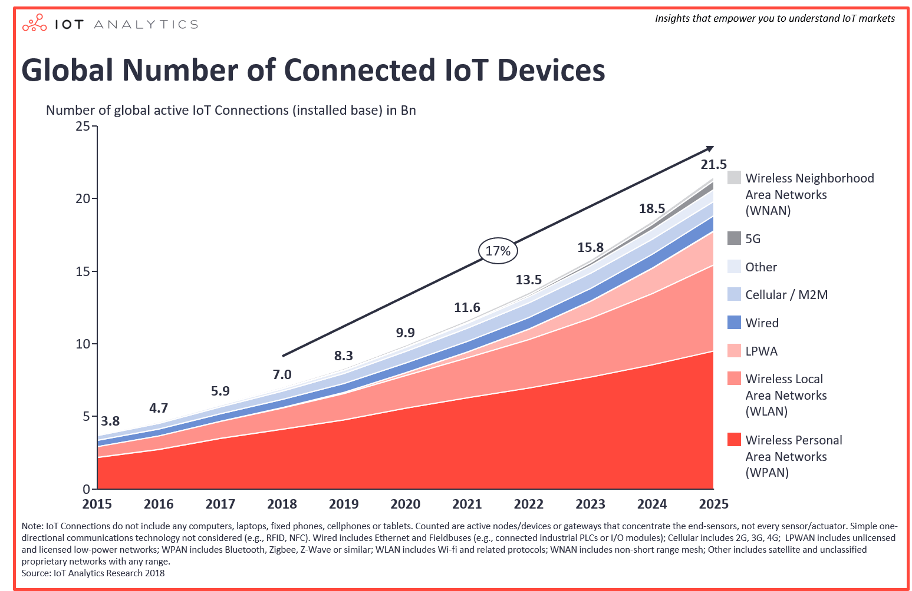

## 市场动态

物联网市场在2018年第一季度/第二季度出现了意想不到的加速，并将使用的物联网设备总数提升至7B。这是IoT Analytics最新“ [物联网和短期展望状态](https://iot-analytics.com/product/state-of-the-iot-2018/) ”更新中的众多发现之一。

全面的公司，尤其是物联网软件，云和服务公司，远远超出了收入预期。Microsoft Azure和Amazon AWS分别增长了93％和49％（在过去12个月内），其物联网部分对增长做出了重大贡献。但像C3IoT这样的小型企业也报告了今年收入增长60％。

<!-- more -->

## 全球连接设备数量：17B

目前全球使用的连接设备数量超过170亿，物联网设备数量达到70亿（此数字不包括智能手机，平板电脑，笔记本电脑或固定电话）。

## 全球物联网设备数量：7B

全球连接增长主要由物联网设备驱动 - 无论是在消费者方面（例如智能家居）还是在企业/ B2B方面（例如，连接机器）。预计到2020年，活跃的物联网设备数量将增加到100亿，到2025年将增加到220亿。这些物联网设备包括所有活动连接，不考虑过去购买但不再使用的设备。

从设备连接的角度来看，动态变化非常大

1. **无线个人网络（WPAN）：**

   最大数量的物联网设备通过短程技术（WPAN）连接，通常在最大范围内不超过100米。这些包括蓝牙连接设备，如耳机，还有Zigbee和Z波连接设备，这些设备大多可以在智能家居中找到，例如，用于连接烟雾报警器或恒温器。

2. **无线局域网（WLAN）**

   另一大类是无线局域网，覆盖长达1公里的连接。Wi-Fi是这一类别中最常见的标准，并且看到了巨大的增长，主要是通过使用家庭助理，智能电视和智能扬声器，但也越来越多地用于工业等工业环境中（尽管它继续扮演次要角色）在这些设置中与其他技术相比）。

3. **低功耗广域网（LPWAN）**

   预计未来物联网设备数量增长的很大一部分将来自低功率广域网。到2025年，预计将通过LPWAN连接超过20亿台设备。该技术承诺极高的电池寿命和超过20公里的最大通信范围被三个主要竞争标准Sigfox，Lora和NB-IoT使用，这些标准目前正在全球范围内推广，已有超过2500万台设备现在连接，其中大部分都是智能电表。

4. **有线**

   当他们想到物联网时，很少有人会想到有线连接。但是，在许多设置中，有线设备连接仍然是最便宜和最可靠的选择。特别是在工业环境中，现场总线和以太网技术在很大程度上使用有线连接，预计在未来几年内仍将这样做。

5. **蜂窝/ M2M**

   2G，3G和4G技术长期以来一直是远程设备连接的唯一选择。随着LPWA和5G的增长势头，预计这些传统蜂窝标准将失去新技术的份额，因为它们为许多终端用户提供了更有利可图的机会。

6. **5G**

   在美国，第一个预标准的5G网络将在今年年底之前为住宅和小型企业用户提供固定无线接入（FWA）服务。虽然在2020年批准最终标准后，将有更多的用例成为目标，但我们应该在明年看到第一批采用者并确实希望从那里快速增长。

   5G是通配符。该技术在2018年仍处于开发阶段，通过其庞大的带宽和极低的延迟来承诺连接的新时代，现在由政府，特别是中国大力推广。为了将技术创新的均衡从美国和欧洲转向中国，中国政府认为5G的采用是一种竞争资产。

7. **无线邻域网（WNAN）**

   无线邻域网（WNAN）在通信范围方面处于WLAN和诸如蜂窝的远程技术之间。该技术的典型支持者包括网状网络，如Wi-Sun或JupiterMesh。在某些情况下，该技术被用作LPWA / Cellular的替代品（例如，在公用事业领域网络中），并且在其他情况下用作互补元件（例如，用于在没有其他任何东西到达的深处进行计量）。

8. **其他**

   其他技术，如卫星和非机密专有网络将继续在物联网中发挥作用，尽管与其他技术相比较小。

## 全球物联网市场：2018年的市场价为151亿美元，预计到2025年将增长至15.67亿美元

目前的市场情绪和短期前景非常乐观。随着越来越多的数据转移到云端，新的物联网应用程序进入市场，分析越来越重要，软件和平台将继续推动市场的发展。 随着物联网设备数量的增加推动销售，但硬件利润率普遍下降，连接和硬件的12个月前景保持稳定。一些硬件专业提供商（例如NVIDIA）似乎不需要硬件商品化。随着LPWA技术刚刚推向全球市场，而5G还没有大规模准备就绪，连接播放器预计将在2019年及之后的几年内出现差距。

全球物联网市场（终端用户在物联网解决方案上的支出）预计将从2017年增长37％至151亿美元。由于物联网的市场加速（如上所述），这些估计值已向上修正，现在预计到2025年总市场将达到1567亿美元。

## 目前的物联网市场趋势

今天的市场环境极具活力，可以观察到几十种趋势，包括边缘到云集成，TSN连接以及物联网和区块链试验。对于此版本的物联网状态报告，IoT Analytics的分析师团队总结了50个这样的见解。

例如，Insight 32强调云供应商现在越来越多地制作自己的云就绪硬件，以提高物联网设备与在公共云或私有云中存储和分析的数据之间的互操作性和性能。领先的物联网云提供商微软，亚马逊和谷歌最近都宣布了自己的硬件。

以下是该报告的摘录，突出了该具体趋势并提供了相关的证据。 如果从云到硬件的这些转变将对某些现有硬件播放器（例如网关提供商或芯片制造商）构成威胁，还有待观察。物联网分析将继续监控此趋势和其他趋势。

## 研究方法和进一步的信息

本文中的所有见解和图表均来自“ [物联网和短期展望2018](https://iot-analytics.com/product/state-of-the-iot-2018) ”报告，这是一份56页的深度市场报告，可供物联网分析订阅客户使用。该报告的目的是告知我们的订阅者市场中发生的事情，使他们始终站在创新的最前沿，最终为他们的公司做出正确的决策。

该报告包括50个关于当前市场环境的见解以及按行业，技术堆栈和地区划分的市场细分。通过领导100多次专家访谈，参加16次行业会议，听取各种简报和分析师电话会议，分析师团队在过去6个月中发现了每个见解和示例点。

## IOT技术窥探

以上这些内容，作者作为一个开发人员，并不是一个投资人员和创业先锋。并不太关系这些具体细节。我所关心的是如何用技术去**实现**或者**模拟**一个支持百万链接的IOT服务器,并不严谨，仅做大家参考。

所需技术:

- MQTT

  ## MQTT

  MQTT由Andy Stanford-Clark（IBM）和Arlen Nipper（Eurotech，现为Cirrus Link）于1999年开发，用于监测穿越沙漠的石油管道。目标是拥有一个**带宽有效且使用很少电池电量的协议**，因为这些设备是通过卫星链路连接的，当时这种设备非常昂贵。
  **与HTTP及其请求/响应范例相比，该协议使用发布/订阅体系结构。**发布/订阅是事件驱动的，可以将消息推送到客户端。中央通信点是MQTT代理，它负责调度发送者和合法接收者之间的所有消息。向代理发布消息的每个客户端都在消息中包含一个主题。**主题是代理的路由信息​​。**每个想要接收消息的客户端都订阅某个主题，并且代理将具有匹配主题的所有消息传递给客户端。因此，客户不必彼此了解，他们只通过主题进行通信。该架构支持高度可扩展的解决方案，而不依赖于数据生产者和数据使用者。

  

  MQTT发布/订阅架构

  与HTTP的区别在于客户端不必提取所需的信息，但是在有新内容的情况下，代理会将信息推送到客户端。因此，每个MQTT客户端都与代理具有永久打开的TCP连接。如果此连接在任何情况下中断，MQTT代理可以缓冲所有消息，并在它重新联机时将它们发送到客户端。
  如前所述，MQTT中用于分派消息的核心概念是主题。**主题是一个简单的字符串，可以有更多的层次结构级别，用斜杠分隔。**用于发送起居室的温度数据的示例主题可以是*房屋/起居室/温度*。一方面，客户端可以订阅确切的主题，或者另一方面使用通配符。对*房屋/ + /温度*的订阅将导致所有消息发送到先前提到的主题*房屋/起居室/温度*以及在起居室的地方具有任意值的任何主题，例如*房屋/厨房/温度*。加号是**单级通配符**，只允许一个层次结构的任意值。如果您需要订阅多个级别，例如订阅整个子树，还有一个**多级通配符**（*＃*）。它允许订阅所有底层层次结构级别。比如*房子/＃*订阅以*house*开头的所有主题。

- Netty

  Netty是 *一个异步事件驱动的网络应用程序框架，* 用于快速开发可维护的高性能协议服务器和客户端。

  

  Netty是一个NIO客户端服务器框架，可以快速轻松地开发协议服务器和客户端等网络应用程序。它极大地简化并简化了TCP和UDP套接字服务器等网络编程。

  “快速简便”并不意味着最终的应用程序会受到可维护性或性能问题的影响。Netty经过精心设计，具有丰富的协议，如FTP，SMTP，HTTP以及各种二进制和基于文本的传统协议。因此，Netty成功地找到了一种在不妥协的情况下实现易于开发，性能，稳定性和灵活性的方法。

  这个可以看下我的博客和github网址,比较浅显,大神忽略。持续更新中...!

  博客园出处：<https://www.cnblogs.com/sanshengshui> 

  github出处：<https://github.com/sanshengshui>　　　　 

  个人博客出处：<https://sanshengshui.github.io/>

- Kafka

  

  ApacheKafka®是*一个分布式流媒体平台*。这到底是什么意思呢？

  流媒体平台有三个关键功能：

  - 发布和订阅记录流，类似于消息队列或企业消息传递系统。
  - 以容错的持久方式存储记录流。
  - 记录发生时处理流。

  Kafka通常用于两大类应用：

  - 构建可在系统或应用程序之间可靠获取数据的实时流数据管道
  - 构建转换或响应数据流的实时流应用程序

  要了解Kafka如何做这些事情，让我们深入探讨Kafka的能力。

- Redis

- MySQL

技术轮廓图:

## 其他

关于IOT市场与技术模拟详解到这里就结束了。

原创不易，如果感觉不错，希望给个推荐！您的支持是我写作的最大动力！

下文会大家逐步用Netty实现MQTT协议的IOT服务器。

版权声明: 

作者：穆书伟 

博客园出处：<https://www.cnblogs.com/sanshengshui> 

github出处：<https://github.com/sanshengshui>　　　　 

个人博客出处：<https://sanshengshui.github.io/>