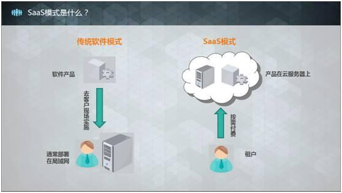
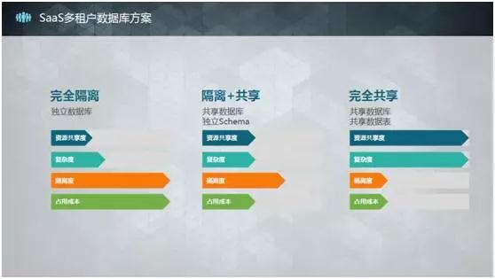
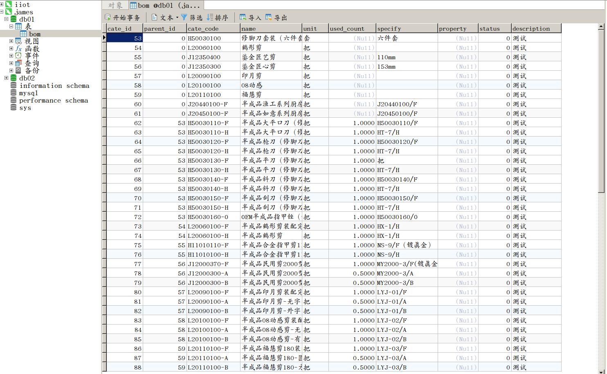
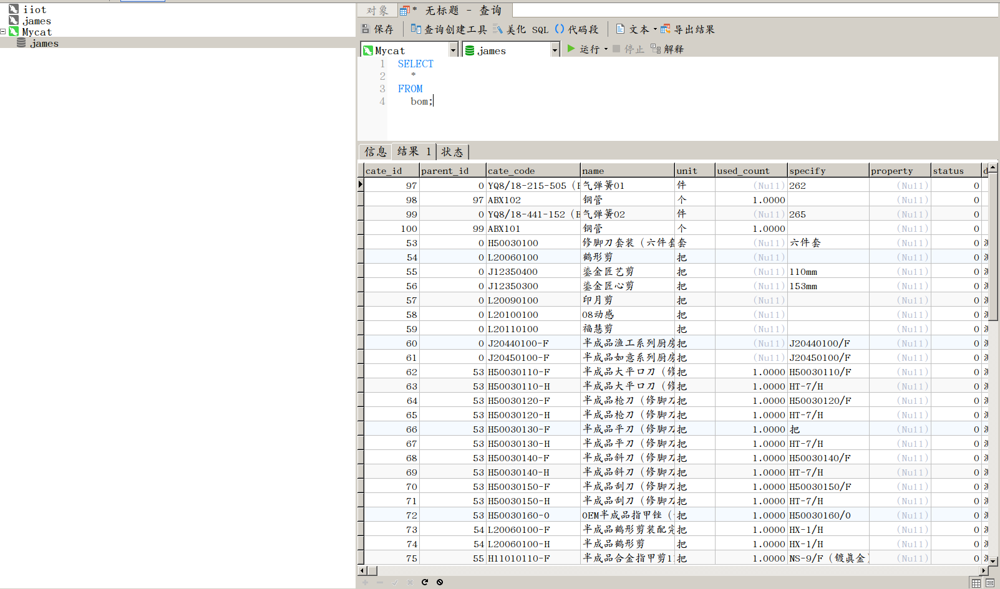
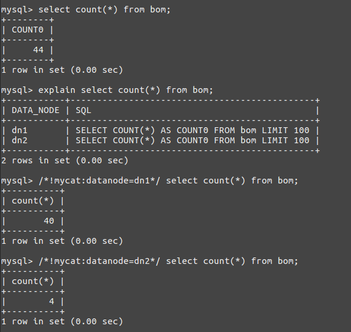
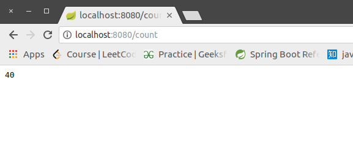
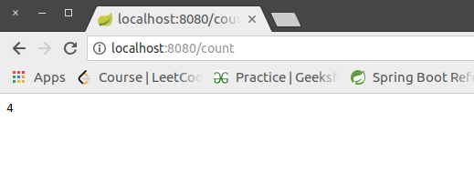

## 前言


### SaaS模式是什么?


传统的软件模式是在开发出软件产品后，需要去客户现场进行实施，通常部署在局域网，这样开发、部署及维护的成本都是比较高的。

现在随着云服务技术的蓬勃发展，就出现了SaaS模式。

所谓SaaS模式即是把产品部署在云服务器上，从前的客户变成了“租户”，我们按照功能和租用时间对租户进行收费。

这样的好处是，用户可以按自己的需求来购买功能和时间，同时自己不需要维护服务器，而我们作为SaaS提供商也免去了跑到客户现场实施的麻烦，运维的风险则主要由IaaS提供商来承担。




<!-- more -->

### SaaS多租户数据库方案

多租户技术或称多重租赁技术，是一种软件架构技术，

是实现如何在多用户环境下共用相同的系统或程序组件，并且可确保各用户间数据的隔离性。

在当下云计算时代，多租户技术在共用的数据中心以单一系统架构与服务提供多数客户端相同甚至可定制化的服务，并且仍可以保障客户的数据隔离。

目前各种各样的云计算服务就是这类技术范畴，例如阿里云数据库服务（RDS）、阿里云服务器等等。

多租户在数据存储上存在三种主要的方案，分别是：

#### 独立数据库

这是第一种方案，即一个租户一个数据库，这种方案的用户数据隔离级别最高，安全性最好，但成本较高。 
优点： 
为不同的租户提供独立的数据库，有助于简化数据模型的扩展设计，满足不同租户的独特需求；如果出现故障，恢复数据比较简单。 
缺点： 
增多了数据库的安装数量，随之带来维护成本和购置成本的增加。 
这种方案与传统的一个客户、一套数据、一套部署类似，差别只在于软件统一部署在运营商那里。如果面对的是银行、医院等需要非常高数据隔离级别的租户，可以选择这种模式，提高租用的定价。如果定价较低，产品走低价路线，这种方案一般对运营商来说是无法承受的。

#### 共享数据库，隔离数据架构 

这是第二种方案，即多个或所有租户共享Database，但是每个租户一个Schema（也可叫做一个user）。 
优点： 
为安全性要求较高的租户提供了一定程度的逻辑数据隔离，并不是完全隔离；每个数据库可支持更多的租户数量。 
缺点： 
如果出现故障，数据恢复比较困难，因为恢复数据库将牵涉到其他租户的数据； 
如果需要跨租户统计数据，存在一定困难。

#### 共享数据库，共享数据架构 

这是第三种方案，即租户共享同一个Database、同一个Schema，但在表中增加TenantID多租户的数据字段。这是共享程度最高、隔离级别最低的模式。 
优点： 
三种方案比较，第三种方案的维护和购置成本最低，允许每个数据库支持的租户数量最多。 
缺点： 
隔离级别最低，安全性最低，需要在设计开发时加大对安全的开发量； 
数据备份和恢复最困难，需要逐表逐条备份和还原。 
如果希望以最少的服务器为最多的租户提供服务，并且租户接受牺牲隔离级别换取降低成本，这种方案最适合。

***选择合理的实现模式*** 
衡量三种模式主要考虑的因素是隔离还是共享。

*成本角度因素* 
隔离性越好，设计和实现的难度和成本越高，初始成本越高。共享性越好，同一运营成本 
下支持的用户越多，运营成本越低。

*安全因素* 
要考虑业务和客户的安全方面的要求。安全性要求越高，越要倾向于隔离。

*从租户数量上考虑* 
主要考虑下面一些因素 
系统要支持多少租户？上百？上千还是上万？可能的租户越多，越倾向于共享。 
平均每个租户要存储数据需要的空间大小。存贮的数据越多，越倾向于隔离。 
每个租户的同时访问系统的最终用户数量。需要支持的越多，越倾向于隔离。 
是否想针对每一租户提供附加的服务，例如数据的备份和恢复等。这方面的需求越多， 越倾向于隔离




------


## 多租户方案之共享数据库，隔离数据架构


### 技术选型

- **Mycat中间件(社区活跃，完全开源的分布式数据库架构)**

- **MyBatis**


### 简要描述

多租户方案采用的是MyBatis+MyCat。DEMO是基于Spring MVC的web项目。

在用户操作过程中获取用户的id信息，利用MyCat强大的注解功能，根据用户id将SQL语句路由到对应该用户的schema或者database去执行。

对SQL加注解的实现则交由MyBatis的插件功能完成，通过自定义MyBatis的Interceptor类，拦截要执行的sql语句加上对应注解。这样就实现了数据库的多租户改造。下面分几个部分来说明。


### MyCat 与MySQL设置


MyCat是一个开源的分布式数据库系统，是一个实现了MySQL协议的服务器，

前端用户可以把它看作是一个数据库代理，用MySQL客户端工具和命令行访问，而其后端可以用MySQL原生协议与多个MySQL服务器通信，

也可以用JDBC协议与大多数主流数据库服务器通信，其核心功能是分表分库，即将一个大表水平分割为N个小表，存储在后端MySQL服务器里或者其他数据库里。

MyCat相当于一个逻辑上的大数据库，又N多个物理数据库组成，可以通过各种分库分表规则(rule）将数据存到规则对应的数据库或schema或表中。

 MyCat对自身不支持的Sql语句提供了一种解决方案——在要执行的SQL语句前添加额外的一段由注解SQL组织的代码，这样Sql就能正确执行，这段代码称之为“注解”。

注解的使用相当于对mycat不支持的sql语句做了一层透明代理转发，直接交给目标的数据节点进行sql语句执行，其中注解SQL用于确定最终执行SQL的数据节点。


注解使用方式如下：

```html
<code class="language-html">/*!mycat: schema=node1*/真正执行Sql</code>  
```

 由于这个项目是根据MyCat的SQL注解来选择在哪个schema或者database上执行的，所以不需要设置rule.xml。


#### 数据库设置

```mysql
create database db01;  
 CREATE TABLE `bom`  (
  `cate_id` bigint(20) NOT NULL AUTO_INCREMENT COMMENT '物料编码',
  `parent_id` bigint(20) NULL DEFAULT NULL COMMENT '父物料ID，一级物料为0',
  `cate_code` varchar(50) CHARACTER SET utf8 COLLATE utf8_general_ci NULL DEFAULT NULL COMMENT '物料编码',
  `name` varchar(50) CHARACTER SET utf8 COLLATE utf8_general_ci NULL DEFAULT NULL COMMENT '物料名称',
  `unit` varchar(20) CHARACTER SET utf8 COLLATE utf8_general_ci NULL DEFAULT NULL COMMENT '计量单位',
  `used_count` double(32, 4) NULL DEFAULT NULL,
  `specify` varchar(50) CHARACTER SET utf8 COLLATE utf8_general_ci NULL DEFAULT NULL COMMENT '规格',
  `property` tinyint(4) NULL DEFAULT NULL COMMENT '2=自制件,1=采购件',
  `status` tinyint(4) NULL DEFAULT NULL COMMENT '状态(0:开启 1：禁用)',
  `description` varchar(100) CHARACTER SET utf8 COLLATE utf8_general_ci NULL DEFAULT NULL COMMENT '描述',
  PRIMARY KEY (`cate_id`) USING BTREE
) ENGINE = InnoDB AUTO_INCREMENT = 101 CHARACTER SET = utf8 COLLATE = utf8_general_ci COMMENT = '物料表' ROW_FORMAT = Dynamic;

create database db02;  
CREATE TABLE `bom`  (
  `cate_id` bigint(20) NOT NULL AUTO_INCREMENT COMMENT '物料编码',
  `parent_id` bigint(20) NULL DEFAULT NULL COMMENT '父物料ID，一级物料为0',
  `cate_code` varchar(50) CHARACTER SET utf8 COLLATE utf8_general_ci NULL DEFAULT NULL COMMENT '物料编码',
  `name` varchar(50) CHARACTER SET utf8 COLLATE utf8_general_ci NULL DEFAULT NULL COMMENT '物料名称',
  `unit` varchar(20) CHARACTER SET utf8 COLLATE utf8_general_ci NULL DEFAULT NULL COMMENT '计量单位',
  `used_count` double(32, 4) NULL DEFAULT NULL,
  `specify` varchar(50) CHARACTER SET utf8 COLLATE utf8_general_ci NULL DEFAULT NULL COMMENT '规格',
  `property` tinyint(4) NULL DEFAULT NULL COMMENT '2=自制件,1=采购件',
  `status` tinyint(4) NULL DEFAULT NULL COMMENT '状态(0:开启 1：禁用)',
  `description` varchar(100) CHARACTER SET utf8 COLLATE utf8_general_ci NULL DEFAULT NULL COMMENT '描述',
  PRIMARY KEY (`cate_id`) USING BTREE
) ENGINE = InnoDB AUTO_INCREMENT = 101 CHARACTER SET = utf8 COLLATE = utf8_general_ci COMMENT = '物料表' ROW_FORMAT = Dynamic;

```


设置两个数据库分表为db01,db02，两个库中都有bom。

#### MyCat的配置

server.xml

```xml
<?xml version="1.0" encoding="UTF-8"?>
<!DOCTYPE mycat:server SYSTEM "server.dtd">
<mycat:server xmlns:mycat="http://io.mycat/">
	<system>
	<property name="useSqlStat">0</property> 
	<property name="useGlobleTableCheck">0</property>  
	<property name="sequnceHandlerType">2</property>
    <property name="handleDistributedTransactions">0</property>
	<property name="useOffHeapForMerge">1</property>
		<property name="memoryPageSize">1m</property>
		<property name="spillsFileBufferSize">1k</property>
		<property name="useStreamOutput">0</property>
		<property name="systemReserveMemorySize">384m</property>
		<property name="useZKSwitch">true</property>
	</system>
	
	<user name="root">
		<property name="password">james</property>
		<property name="schemas">james</property>
	</user>

</mycat:server>

```


server.xml主要是设置登录用户名密码，登录端口之类的信息。


重头戏是schema.xml的设置

```xml
<?xml version="1.0"?>
<!DOCTYPE mycat:schema SYSTEM "schema.dtd">
<mycat:schema xmlns:mycat="http://io.mycat/">

	<schema name="james" checkSQLschema="false" sqlMaxLimit="100">
		<table name="bom" dataNode="dn1,dn2" />
	</schema>
	<dataNode name="dn1" dataHost="localhost1" database="db01" />
	<dataNode name="dn2" dataHost="localhost1" database="db02" />
	<dataHost name="localhost1" maxCon="1000" minCon="10" balance="0"
			  writeType="0" dbType="mysql" dbDriver="native" switchType="1"  slaveThreshold="100">
		<heartbeat>select user()</heartbeat>
		<writeHost host="hostS1" url="localhost:3306" user="root"
				   password="jamesmsw" />
	</dataHost>
	
</mycat:schema>
```

这里配置好两个数据库节点dn1,dn2对应的就是这前面建立的数据库db02,db03.

这样数据库和Mycat就设置好了，我们可以测试一下，向两个库中插入一些数据：



这是db01的数据,共40条.


这是db02中的数据,共8条.



这是mycat的逻辑库james中的数据，可以看到，包含了所有的db01和db02的数据。


再来试试MyCat的注解：

在mycat的逻辑库TESTDB中分别执行以下语句：

```sql
mysql> select count(*) from bom;
/*!mycat: datanode=dn1*/select count(*) from bom;
/*!mycat: datanode=dn2*/select count(*) from bom;
```



可以看到，注解实实在在地把SQL语句路由到对应的数据库中去执行了，而不加注解的SQL则在整个逻辑库上执行。


#### MyBatis设置插件拦截器

MyBatis要使用MyCat很方便，SpringBoot下，只需要将对应的url改成MyCat的端口就行了。

```xml
spring.thymeleaf.mode=LEGACYHTML5
spring.datasource.url=jdbc:mysql://localhost:8066/james?serverTimezone=GMT
spring.datasource.username=root
spring.datasource.password=james
spring.datasource.driver-class-name=com.mysql.jdbc.Driver
mybatis.config-location=classpath:mybatis.xml
```

MyBatis 允许你在已映射语句执行过程中的某一点进行拦截调用。

默认情况下，MyBatis 允许使用插件来拦截的方法调用包括：

- Executor (update, query, flushStatements, commit, rollback, 
  getTransaction, close, isClosed)
- ParameterHandler (getParameterObject, setParameters)
- ResultSetHandler (handleResultSets, handleOutputParameters)
- StatementHandler (prepare, parameterize, batch, update, query)


这些类中方法的细节可以通过查看每个方法的签名来发现，或者直接查看 MyBatis 的发行包中的源代码。 

假设你想做的不仅仅是监控方法的调用，那么你应该很好的了解正在重写的方法的行为。 

因为如果在试图修改或重写已有方法的行为的时候，你很可能在破坏 MyBatis 的核心模块。 这些都是更低层的类和方法，所以使用插件的时候要特别当心。

通过 MyBatis 提供的强大机制，使用插件是非常简单的，只需实现 Interceptor 接口，并指定了想要拦截的方法签名即可。

在这里为了实现SQL的改造增加注解，Executor通过调度StatementHandler来完成查询的过程，通过调度它的prepare方法预编译SQL，因此我们可以拦截StatementHandler的prepare方法，在此之前完成SQL的重新编写。

```java
package org.apache.ibatis.executor.statement;
 
import java.sql.Connection;
import java.sql.SQLException;
import java.sql.Statement;
import java.util.List;
import org.apache.ibatis.cursor.Cursor;
import org.apache.ibatis.executor.parameter.ParameterHandler;
import org.apache.ibatis.mapping.BoundSql;
import org.apache.ibatis.session.ResultHandler;
 
public interface StatementHandler {
    Statement prepare(Connection var1, Integer var2) throws SQLException;
 
    void parameterize(Statement var1) throws SQLException;
 
    void batch(Statement var1) throws SQLException;
 
    int update(Statement var1) throws SQLException;
 
    <E> List<E> query(Statement var1, ResultHandler var2) throws SQLException;
 
    <E> Cursor<E> queryCursor(Statement var1) throws SQLException;
 
    BoundSql getBoundSql();
 
    ParameterHandler getParameterHandler();
}

```

以上的任何方法都可以拦截。从接口定义而言，Prepare方法有一个参数Connection对象，因此按如下代码设计拦截器：

```java
package com.sanshengshui.multitenant.interceptor;

import com.sanshengshui.multitenant.utils.SessionUtil;
import org.apache.ibatis.executor.statement.StatementHandler;
import org.apache.ibatis.plugin.*;
import org.apache.ibatis.reflection.MetaObject;
import org.apache.ibatis.reflection.SystemMetaObject;

import java.sql.Connection;
import java.util.Properties;

@Intercepts(value = {
        @Signature(type = StatementHandler.class,
                method = "prepare",
                args = {Connection.class,Integer.class})})
public class MyInterceptor implements Interceptor {
    private static final String preState="/*!mycat:datanode=";
    private static final String afterState="*/";

    @Override
    public Object intercept(Invocation invocation) throws Throwable {
        StatementHandler statementHandler=(StatementHandler)invocation.getTarget();
        MetaObject metaStatementHandler=SystemMetaObject.forObject(statementHandler);
        Object object=null;
        //分离代理对象链
        while(metaStatementHandler.hasGetter("h")){
            object=metaStatementHandler.getValue("h");
            metaStatementHandler=SystemMetaObject.forObject(object);
        }
        statementHandler=(StatementHandler)object;
        String sql=(String)metaStatementHandler.getValue("delegate.boundSql.sql");
        /*
        String node=(String)TestController.threadLocal.get();
        */
        String node=(String) SessionUtil.getSession().getAttribute("corp");
        if(node!=null) {
            sql = preState + node + afterState + sql;
        }

        System.out.println("sql is "+sql);
        metaStatementHandler.setValue("delegate.boundSql.sql",sql);
        Object result = invocation.proceed();
        System.out.println("Invocation.proceed()");
        return result;
    }

    @Override
    public Object plugin(Object target) {

        return Plugin.wrap(target, this);
    }

    @Override
    public void setProperties(Properties properties) {
        String prop1 = properties.getProperty("prop1");
        String prop2 = properties.getProperty("prop2");
        System.out.println(prop1 + "------" + prop2);
    }
}

```

简单说明一下：

 intercept 真个是插件真正运行的方法，它将直接覆盖掉你真实拦截对象的方法。里面有一个Invocation对象，利用它可以调用你原本要拦截的对象的方法

plugin    它是一个生成动态代理对象的方法，

setProperties 它是允许你在使用插件的时候设置参数值。


```
@Intercepts(value = {
        @Signature(type = StatementHandler.class,
                method = "prepare",
                args = {Connection.class,Integer.class})})
```


这段说明了要拦截的目标类和方法以及参数。

StatementHandler是一个借口，真实的对象是RoutingStatementHandler,但它不是真实的服务对象，里面的delegate是StatementHandler中真实的StatementHandler实现的类，有多种，它里面的boundSql中存储着SQL语句。具体的可以参考MyBatis的源码。

MetaObject是一个工具类，由于MyBatis四大对象提供的public设置参数的方法很少，难以通过自身得到相关属性信息，但是有个MetaObject这个工具类就可以通过其他的技术手段来读取和修改这些重要对象的属性。

SessionUtil的getSession方法是用来获取之前用户登录时获得的记录在session中的corp信息，根据这个信息拼装SQL注解达到多租户的目的。

Interceptor写好后，写入到mybatis.xml的plugin中

```
<?xml version="1.0" encoding="UTF-8"?>
<!DOCTYPE configuration
        PUBLIC "-//mybatis.org//DTD Config 3.0//EN"
        "http://mybatis.org/dtd/mybatis-3-config.dtd">

<configuration>
    <settings>
        <!-- 打印查询语句 -->
        <setting name="logImpl" value="STDOUT_LOGGING" />
    </settings>

    <typeAliases>
        <typeAlias alias="BomDO" type="com.sanshengshui.multitenant.pojo.BomDO"/>

    </typeAliases>

    <plugins>
        <plugin interceptor="com.sanshengshui.multitenant.interceptor.MyInterceptor">
        </plugin>
    </plugins>
</configuration>
```


#### 实际运行


写一个实体类.

```
package com.sanshengshui.multitenant.pojo;

import lombok.Data;

import java.io.Serializable;

@Data
public class BomDO implements Serializable {
    private static final long serialVersionUID = 1L;
    //物料编码
    private Long cateId;
    //父物料ID，一级物料为0
    private Long parentId;
    //物料编码
    private String cateCode;
    //物料名称
    private String name;
    //计量单位
    private String unit;
    //规格
    private String specify;
    //状态(0:开启 1：禁用)
    private Integer status;
    //使用数量
    private Double usedCount;
    //描述
    private String description;
    //2=自制件,1=采购件
    private Integer property;

    public Long getCateId() {
        return cateId;
    }

    public void setCateId(Long cateId) {
        this.cateId = cateId;
    }

    public Long getParentId() {
        return parentId;
    }

    public void setParentId(Long parentId) {
        this.parentId = parentId;
    }

    public String getCateCode() {
        return cateCode;
    }

    public void setCateCode(String cateCode) {
        this.cateCode = cateCode;
    }

    public String getName() {
        return name;
    }

    public void setName(String name) {
        this.name = name;
    }

    public String getUnit() {
        return unit;
    }

    public void setUnit(String unit) {
        this.unit = unit;
    }

    public String getSpecify() {
        return specify;
    }

    public void setSpecify(String specify) {
        this.specify = specify;
    }

    public Integer getStatus() {
        return status;
    }

    public void setStatus(Integer status) {
        this.status = status;
    }

    public Double getUsedCount() {
        return usedCount;
    }

    public void setUsedCount(Double usedCount) {
        this.usedCount = usedCount;
    }

    public String getDescription() {
        return description;
    }

    public void setDescription(String description) {
        this.description = description;
    }

    public Integer getProperty() {
        return property;
    }

    public void setProperty(Integer property) {
        this.property = property;
    }
}

```

写一个mapper

```
package com.sanshengshui.multitenant.mapper;

import com.sanshengshui.multitenant.pojo.BomDO;
import org.apache.ibatis.annotations.Mapper;

import java.util.List;
import java.util.Map;

@Mapper
public interface BomMapper {

    List<BomDO> list(Map<String, Object> map);

    int count(Map<String, Object> map);
    
}package com.sanshengshui.multitenant.mapper;

import com.sanshengshui.multitenant.pojo.BomDO;
import org.apache.ibatis.annotations.Mapper;

import java.util.List;
import java.util.Map;

@Mapper
public interface BomMapper {

    List<BomDO> list(Map<String, Object> map);

    int count(Map<String, Object> map);
    
}

```

以及对应的BomMapper.xml，配置好sql语句。

```
<?xml version="1.0" encoding="UTF-8"?>
<!DOCTYPE mapper PUBLIC "-//mybatis.org//DTD Mapper 3.0//EN" "http://mybatis.org/dtd/mybatis-3-mapper.dtd">

<mapper namespace="com.sanshengshui.multitenant.mapper.BomMapper">

	<select id="get" resultType="com.sanshengshui.multitenant.pojo.BomDO">
		select `cate_id`,`parent_id`,`cate_code`,`name`,`unit`,`used_count`,`specify`,`property`,`status`,`description` from bom where cate_id = #{value}
	</select>
	
	<select id="list" resultType="com.sanshengshui.multitenant.pojo.BomDO">
		select `cate_id`,`parent_id`,`cate_code`,`name`,`unit`,`used_count`,`specify`,`property`,`status`,`description` from bom
        <where>  
		  		  <if test="cateId != null and cateId != ''"> and cate_id = #{cateId} </if>
		  		  <if test="parentId != null and parentId != ''"> and parent_id = #{parentId} </if>
		  		  <if test="cateCode != null and cateCode != ''"> and cate_code = #{cateCode} </if>
		  		  <if test="name != null and name != ''"> and name = #{name} </if>
		  		  <if test="unit != null and unit != ''"> and unit = #{unit} </if>
		  		  <if test="usedCount != null and usedCount != ''"> and used_count = #{usedCount} </if>
		  		  <if test="specify != null and specify != ''"> and specify = #{specify} </if>
		  		  <if test="property != null and property != ''"> and property = #{property} </if>
		  		  <if test="status != null and status != ''"> and status = #{status} </if>
		  		  <if test="description != null and description != ''"> and description = #{description} </if>
		  		</where>
        <choose>
            <when test="sort != null and sort.trim() != ''">
                order by ${sort} ${order}
            </when>
			<otherwise>
                order by cate_id desc
			</otherwise>
        </choose>
		<if test="offset != null and limit != null">
			limit #{offset}, #{limit}
		</if>
	</select>
	<!-- 为了保证mycat分库的操作会进行，同一查询会重新执行而不是在sqlSession中查找，需要加上flushCache="true"-->
 	<select id="count" flushCache="true" resultType="int">
		select count(*) from bom
		 <where>  
		  		  <if test="cateId != null and cateId != ''"> and cate_id = #{cateId} </if>
		  		  <if test="parentId != null and parentId != ''"> and parent_id = #{parentId} </if>
		  		  <if test="cateCode != null and cateCode != ''"> and cate_code = #{cateCode} </if>
		  		  <if test="name != null and name != ''"> and name = #{name} </if>
		  		  <if test="unit != null and unit != ''"> and unit = #{unit} </if>
		  		  <if test="usedCount != null and usedCount != ''"> and used_count = #{usedCount} </if>
		  		  <if test="specify != null and specify != ''"> and specify = #{specify} </if>
		  		  <if test="property != null and property != ''"> and property = #{property} </if>
		  		  <if test="status != null and status != ''"> and status = #{status} </if>
		  		  <if test="description != null and description != ''"> and description = #{description} </if>
		  		</where>
	</select>
	 
	<insert id="save" parameterType="com.sanshengshui.multitenant.pojo.BomDO" useGeneratedKeys="true" keyProperty="cateId">
		insert into bom
		(
			`parent_id`, 
			`cate_code`, 
			`name`, 
			`unit`, 
			`used_count`, 
			`specify`, 
			`property`, 
			`status`, 
			`description`
		)
		values
		(
			#{parentId}, 
			#{cateCode}, 
			#{name}, 
			#{unit}, 
			#{usedCount}, 
			#{specify}, 
			#{property}, 
			#{status}, 
			#{description}
		)
	</insert>

</mapper>
```

这里还是来测试count方法。

写一个controller

```
package com.sanshengshui.multitenant.controller;

import com.sanshengshui.multitenant.mapper.BomMapper;
import com.sanshengshui.multitenant.pojo.BomDO;
import com.sanshengshui.multitenant.utils.SessionUtil;
import org.springframework.beans.factory.annotation.Autowired;
import org.springframework.stereotype.Controller;
import org.springframework.web.bind.annotation.GetMapping;
import org.springframework.web.bind.annotation.PathVariable;
import org.springframework.web.bind.annotation.ResponseBody;

import javax.servlet.http.HttpSession;
import java.util.HashMap;
import java.util.List;
import java.util.Map;

@Controller
public class TestController {

    @Autowired
    BomMapper bomMapper;

    //简化，直接通过这里设置session
    @GetMapping("/set/{sess}")
    @ResponseBody
    public Object setSession(@PathVariable("sess") String sess){
        HttpSession httpSession= SessionUtil.getSession();
        httpSession.setAttribute("corp",sess);
        return "ok";
    }

    @ResponseBody
    @GetMapping("/list")
    public List<BomDO> list(){
        Map<String, Object> query = new HashMap<>(16);
        List<BomDO> bomList = bomMapper.list(query);
        return bomList;
    }
    
    @GetMapping("/count")
    @ResponseBody
    public Object getCount(){
        //要测试的方法
        Map<String, Object> map = new HashMap<String, Object>();
        return bomMapper.count(map);
    }   
}
```

首先通过localhost:8080/set/{sess}设置session，假设session设置为dn1.

浏览器中输入localhost:8080/set/dn1.

之后，输入localhost:8080/count.

结果如下：



来看下打印的sql语句：


可以看到，SQL注解已经成功添加进去了。

在设置session为dn2



结果如下。

打印的sql语句：

