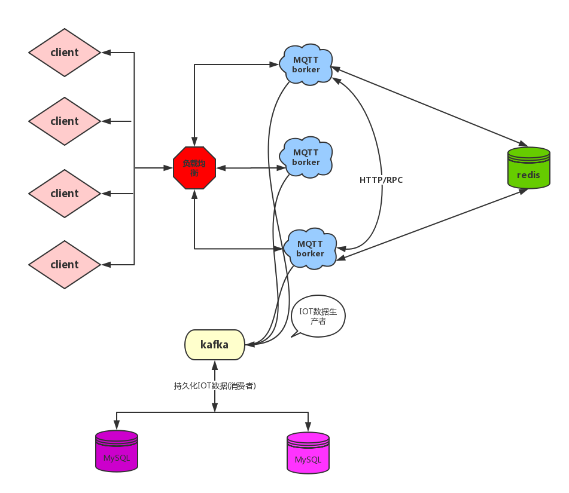
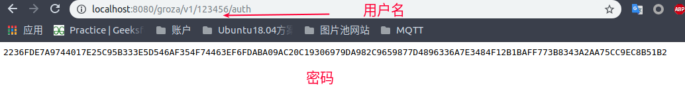

**运行环境:**

- JDK 8+
- Maven 3.0+
- Redis

**技术栈:**

- SpringBoot 2.0+
- Redis (**Lettuce**客户端,**RedisTemplate**模板方法)
- Netty 4.1+
- MQTT 3.1.1

**IDE:**

- IDEA或者Eclipse
- Lombok插件


# 简介

近年来，物联网高歌猛进，美国有“工业互联网”，德国有“工业4.0”，我国也有“中国制造2025”，这背后都是云计算、大数据。据波士顿咨询报告，单单中国制造业，云计算、大数据、人工智能等新技术就能为其带来高达6万亿的额外附加值。

国内外巨头纷纷驻足工业互联网，国外如亚马逊AWS、微软Azure，国内则是三大电信运营商、百度云、华为、金山云等，其中腾讯云、阿里云最甚，还拉来了传统制造大佬,国内巨头纷纷在物联网上布局。在2018云栖-深圳峰会上，阿里巴巴资深副总裁，阿里云总裁胡晓明宣布阿里巴巴将正式进军IoT。胡晓明表示，IoT是阿里巴巴集团继电商、金融、物流、云计算之后的一条新的主赛道。


<!-- more -->

# IOT技术窥探

以上这些内容，作者作为一个开发人员，并不是一个投资人员和创业先锋。并不太关系这些具体细节。我所关心的是如何用技术去**实现**或者**模拟**一个支持百万链接的IOT服务器,并不严谨，仅做大家参考。

关于为什么选用下图的中间件或者对MQTT不太了解的话,可以阅读我之前的2篇文章:

1. [IOT高性能服务器实现之路](https://www.cnblogs.com/sanshengshui/p/9797352.html)
2. [Netty实现高性能IOT服务器(Groza)之手撕MQTT协议篇上](https://www.cnblogs.com/sanshengshui/p/9826009.html)

## 技术轮廓图




# 快速入门


## 运行测试

1. git clone https://github.com/sanshengshui/netty-learning-example 

2. cd netty-iot

3. 运行 NettyIotApplication

4. 打开 http://localhost:8080/groza/v1/123456/auth,获取密码！

5. 启动Eclipse Paho,并填写用户名和密码，即可连接。

6. 另起一个Eclipse Paho,订阅随意主题,例如test。另一个Eclipse Paho发布主题test。即可收到消息。

7. 取消主题订阅，再次发布消息。就收不到消息。

   

有了前面2篇文章的铺垫并学习了MQTT V3.1.1 协议,说了那么多，手痒痒的很。

**You build it, You run it！**

## 项目结构介绍

```
netty-iot
      ├── auth -- 认证
        ├── service -- 用户名,密码认证实现类
        ├── util -- 认证工具类
      ├── common -- 公共类
        ├── auth -- 用户名,密码认证接口
        ├── message -- 协议存储实体及接口类
        ├── session -- session存储实体及接口类
        ├── subscribe -- 订阅存储实体及接口类
      ├── config -- Redis配置
      ├── protocol -- MQTT协议实现
      ├── server -- MQTT服务器
      ├── store -- Redis数据存储
      	├── cache 
        ├── message 
        ├── session
        ├── subscribe
      ├── web -- web服务
      ├── NettyIotApplication -- 服务启动类
```

## Redis

### 安装

体验 Redis 需要使用 Linux 或者 Mac 环境，如果是 Windows 可以考虑使用虚拟机。主要方式有四种：

- 使用 Docker 安装。
- 通过 Github 源码编译。
- 直接安装 apt-get install(Ubuntu)、yum install(RedHat) 或者 brew install(Mac)。
- 如果读者懒于安装操作，也可以使用网页版的 [Web Redis](https://try.redis.io/) 直接体验。

具体操作如下：

**Docker 方式**

```
# 拉取 redis 镜像
> docker pull redis
# 运行 redis 容器
> docker run --name myredis -d -p6379:6379 redis
# 执行容器中的 redis-cli，可以直接使用命令行操作 redis
> docker exec -it myredis redis-cli...
```

**Github 源码编译方式**

```
# 下载源码
> git clone --branch 2.8 --depth 1 git@github.com:antirez/redis.git
> cd redis
# 编译
> make
> cd src
# 运行服务器，daemonize表示在后台运行
> ./redis-server --daemonize yes
# 运行命令行
> ./redis-cli...
```

**直接安装方式**

```
# mac
> brew install redis
# ubuntu
> apt-get install redis
# redhat
> yum install redis
# 运行客户端
> redis-cli
```

### 使用

Spring Boot` 除了支持常见的ORM框架外，更是对常用的中间件提供了非常好封装，随着`Spring Boot2.x`的到来，支持的组件越来越丰富，也越来越成熟，其中对`Redis`的支持不仅仅是丰富了它的API，更是替换掉底层`Jedis`的依赖，取而代之换成了`Lettuce(生菜),大家可以参考这篇[文章](https://blog.csdn.net/memmsc/article/details/80523376)对工程进行配置。所以我使用Lettuce作为客户端来对我的MQTT协议传输的消息进行缓存。

下列的是Redis所对应的操作方式

- opsForValue： 对应 String（字符串）
- opsForZSet： 对应 ZSet（有序集合）
- opsForHash： 对应 Hash（哈希）
- opsForList： 对应 List（列表）
- opsForSet： 对应 Set（集合）
- opsForGeo： 对应 GEO（地理位置）

我主要使用**opsForValue**,**opsForHash**和**opsForZSet**，对于字符串。我推荐使用**StringRedisTemplate**。

以下对于opsForValue和opsForHash的基础操作，我在这里简短的讲解一下。


#### **Redis的Hash数据机构**

Redis的散列可以让用户将多个键值对存储到一个Redis键里面。
public interface HashOperations<H,HK,HV>
HashOperations提供一系列方法操作hash：

```
java > template.opsForHash().put("books","java","think in java");
redis-cli > hset books java "think in java"  # 命令行的字符串如果包含空格，要用引号括起来
(integer) 1
------
java > template.opsForHash().put("books","golang","concurrency in go");
redis-cli > hset books golang "concurrency in go"
(integer) 1
------
java > template.opsForHash().put("books","python","python cookbook");
redis-cli > hset books python "python cookbook"
(integer) 1
------
java > template.opsForHash().entries("books")
redis-cli > hgetall books  # entries()，key 和 value 间隔出现
1) "java"
2) "think in java"
3) "golang"
4) "concurrency in go"
5) "python"
6) "python cookbook"
------
java > template.opsForHash().size("books")
redis-cli > hlen books
(integer) 3
------
java > template.opsForHash().get("redisHash","age")
redi-cli > hget books java
"think in java"
------
java > 
Map<String,Object> testMap = new HashMap();
      testMap.put("java","effective java");
      testMap.put("python","learning python");
      testMap.put("golang","modern golang programming");
template.opsForHash().putAll("books",testMap);
redis-cli > hmset books java "effective java" python "learning python" golang "modern golang programming"  # 批量 set
OK...

```

#### **Redis的Set数据结构**

Redis的Set是string类型的无序集合。集合成员是唯一的，这就意味着集合中不能出现重复的数据。
Redis 中 集合是通过哈希表实现的，所以添加，删除，查找的复杂度都是O(1)。

```
java > template.opsForSet().add("python","java","golang")
redis-cli > sadd books python java golang
(integer) 3
------
java > template.opsForSet().members("books")
redis-cli > smembers books  # 注意顺序，和插入的并不一致，因为 set 是无序的
1) "java"
2) "python"
3) "golang"
------
java > template.opsForSet().isMember("books","java")
redis-cli > sismember books java  # 查询某个 value 是否存在，相当于 contains(o)
(integer) 1
------
java > template.opsForSet().size("books")
redis-cli > scard books  # 获取长度相当于 count()
(integer) 3
------
java > template.opsForSet().pop("books")
redis-cli > spop books  # 弹出一个
"java"...
```


## MQTT

MQTT是一种轻量级的发布/订阅消息传递协议，最初由IBM和Arcom（后来成为Eurotech的一部分）于1998年左右创建。现在，[MQTT 3.1.1规范](http://docs.oasis-open.org/mqtt/mqtt/v3.1.1/os/mqtt-v3.1.1-os.html)已由[OASIS联盟](https://www.oasis-open.org/committees/mqtt/charter.php)标准化。


### 客户端下载


对于MQTT客户端，我选用[Eclipse Paho](http://www.eclipse.org/paho/),Eclipse Paho项目提供针对物联网（IoT）的新的，现有的和新兴的应用程序的MQTT和MQTT-SN消息传递协议的开源客户端实现。具体[下载地址]( https://repo.eclipse.org/content/repositories/paho-releases/org/eclipse/paho/org.eclipse.paho.ui.app/1.1.1/),大家根据自己的操作系统自行下载。


### MQTT控制报文

```
├── Connect -- 连接服务端
├── DisConnect -- 断开连接
├── PingReq -- 心跳请求
├── PubAck -- 发布确认
├── PubComp -- 发布完成(QoS2,第散步)
├── Publish -- 发布消息
├── PubRec -- 发布收到(QoS2,第一步)
├── PubRel -- 发布释放(QoS2,第二步)
├── Subscribe -- 订阅主题
├── UnSubscribe -- 取消订阅
```

#### Connect

让我们对照着MQTT 3.1.1协议来实现客户端Connect协议。

1. 当我们对消息解码时，如果协议名不正确服务端**可以**断开客户端的连接，按照本规范，服务端**不能**继续处理CONNECT报。

2. 服务端使用客户端标识符 (ClientId) 识别客户端。连接服务端的每个客户端都有唯一的客户端标识符（ClientId）。

   ```
   // 消息解码器出现异常
           if (msg.decoderResult().isFailure()) {
               Throwable cause = msg.decoderResult().cause();
               if (cause instanceof MqttUnacceptableProtocolVersionException) {
                   // 不支持的协议版本
                   MqttConnAckMessage connAckMessage = (MqttConnAckMessage) MqttMessageFactory.newMessage(
                           new MqttFixedHeader(MqttMessageType.CONNACK, false, MqttQoS.AT_MOST_ONCE, false, 0),
                           new MqttConnAckVariableHeader(MqttConnectReturnCode.CONNECTION_REFUSED_UNACCEPTABLE_PROTOCOL_VERSION, false), null);
                   channel.writeAndFlush(connAckMessage);
                   channel.close();
                   return;
               } else if (cause instanceof MqttIdentifierRejectedException) {
                   // 不合格的clientId
                   MqttConnAckMessage connAckMessage = (MqttConnAckMessage) MqttMessageFactory.newMessage(
                           new MqttFixedHeader(MqttMessageType.CONNACK, false, MqttQoS.AT_MOST_ONCE, false, 0),
                           new MqttConnAckVariableHeader(MqttConnectReturnCode.CONNECTION_REFUSED_IDENTIFIER_REJECTED, false), null);
                   channel.writeAndFlush(connAckMessage);
                   channel.close();
                   return;
               }
               channel.close();
               return;
           }
   ```

3. clientId为空或null的情况, 这里要求客户端必须提供clientId, 不管cleanSession是否为1, 此处没有参考标准协议实现

   ```
          if (StrUtil.isBlank(msg.payload().clientIdentifier())) {
               MqttConnAckMessage connAckMessage = (MqttConnAckMessage) MqttMessageFactory.newMessage(
                       new MqttFixedHeader(MqttMessageType.CONNACK, false, MqttQoS.AT_MOST_ONCE, false, 0),
                       new MqttConnAckVariableHeader(MqttConnectReturnCode.CONNECTION_REFUSED_IDENTIFIER_REJECTED, false), null);
               channel.writeAndFlush(connAckMessage);
               channel.close();
               return;
           }
   ```

4. 用户名和密码验证, 这里要求客户端连接时必须提供用户名和密码, 不管是否设置用户名标志和密码标志为1, 此处没有参考标准协议实现

   ```
           String username = msg.payload().userName();
           String password = msg.payload().passwordInBytes() == null ? null : new String(msg.payload().passwordInBytes(), CharsetUtil.UTF_8);
           if (!grozaAuthService.checkValid(username,password)) {
               MqttConnAckMessage connAckMessage = (MqttConnAckMessage) MqttMessageFactory.newMessage(
                       new MqttFixedHeader(MqttMessageType.CONNACK, false, MqttQoS.AT_MOST_ONCE, false, 0),
                       new MqttConnAckVariableHeader(MqttConnectReturnCode.CONNECTION_REFUSED_BAD_USER_NAME_OR_PASSWORD, false), null);
               channel.writeAndFlush(connAckMessage);
               channel.close();
               return;
           }
   ```

1. 如果会话中已存储这个新连接的clientId, 就关闭之前该clientId的连接

   ```
    if (grozaSessionStoreService.containsKey(msg.payload().clientIdentifier())){
               SessionStore sessionStore = grozaSessionStoreService.get(msg.payload().clientIdentifier());
               Channel previous = sessionStore.getChannel();
               Boolean cleanSession = sessionStore.isCleanSession();
               if (cleanSession){
                   grozaSessionStoreService.remove(msg.payload().clientIdentifier());
                   grozaSubscribeStoreService.removeForClient(msg.payload().clientIdentifier());
                   grozaDupPublishMessageStoreService.removeByClient(msg.payload().clientIdentifier());
                   grozaDupPubRelMessageStoreService.removeByClient(msg.payload().clientIdentifier());
               }
               previous.close();
           }
   ```

2. 处理遗嘱信息

   ```
   SessionStore sessionStore = new SessionStore(msg.payload().clientIdentifier(), channel, msg.variableHeader().isCleanSession(), null);
           if (msg.variableHeader().isWillFlag()){
               MqttPublishMessage willMessage = (MqttPublishMessage) MqttMessageFactory.newMessage(
                       new MqttFixedHeader(MqttMessageType.PUBLISH,false, MqttQoS.valueOf(msg.variableHeader().willQos()),msg.variableHeader().isWillRetain(),0),
                       new MqttPublishVariableHeader(msg.payload().willTopic(),0),
                       Unpooled.buffer().writeBytes(msg.payload().willMessageInBytes())
               );
               sessionStore.setWillMessage(willMessage);
           }
   ```

3. 处理连接心跳包

   ```
   if (msg.variableHeader().keepAliveTimeSeconds() > 0){
               if (channel.pipeline().names().contains("idle")){
                   channel.pipeline().remove("idle");
               }
               channel.pipeline().addFirst("idle",new IdleStateHandler(0, 0, Math.round(msg.variableHeader().keepAliveTimeSeconds() * 1.5f)));
           }
   ```

4. 至此存储会话消息及返回接受客户端连接 将clientId存储到channel的map中

   ```
   grozaSessionStoreService.put(msg.payload().clientIdentifier(),sessionStore);
           channel.attr(AttributeKey.valueOf("clientId")).set(msg.payload().clientIdentifier());
           Boolean sessionPresent = grozaSessionStoreService.containsKey(msg.payload().clientIdentifier()) && !msg.variableHeader().isCleanSession();
           MqttConnAckMessage okResp = (MqttConnAckMessage) MqttMessageFactory.newMessage(
                   new MqttFixedHeader(MqttMessageType.CONNACK,false,MqttQoS.AT_MOST_ONCE,false,0),
                   new MqttConnAckVariableHeader(MqttConnectReturnCode.CONNECTION_ACCEPTED,sessionPresent),
                   null
           );
           channel.writeAndFlush(okResp);
   ```

5. 如果cleanSession为0, 需要重发同一clientId存储的未完成的QoS1和QoS2的DUP消息

   ```
    if (!msg.variableHeader().isCleanSession()){
               List<DupPublishMessageStore> dupPublishMessageStoreList = grozaDupPublishMessageStoreService.get(msg.payload().clientIdentifier());
               List<DupPubRelMessageStore> dupPubRelMessageStoreList = grozaDupPubRelMessageStoreService.get(msg.payload().clientIdentifier());
               dupPublishMessageStoreList.forEach(dupPublishMessageStore -> {
                   MqttPublishMessage publishMessage = (MqttPublishMessage)MqttMessageFactory.newMessage(
                           new MqttFixedHeader(MqttMessageType.PUBLISH,true,MqttQoS.valueOf(dupPublishMessageStore.getMqttQoS()),false,0),
                           new MqttPublishVariableHeader(dupPublishMessageStore.getTopic(),dupPublishMessageStore.getMessageId()),
                           Unpooled.buffer().writeBytes(dupPublishMessageStore.getMessageBytes())
                   );
                   channel.writeAndFlush(publishMessage);
               });
               dupPubRelMessageStoreList.forEach(dupPubRelMessageStore -> {
                   MqttMessage pubRelMessage = MqttMessageFactory.newMessage(
                           new MqttFixedHeader(MqttMessageType.PUBREL,true,MqttQoS.AT_MOST_ONCE,false,0),
                           MqttMessageIdVariableHeader.from(dupPubRelMessageStore.getMessageId()),
                           null
                   );
                   channel.writeAndFlush(pubRelMessage);
               });
           }
   ```

   其他MQTT报文大家对照着工程并对照着[MQTT v3.1.1](https://juejin.im/post/5bcc4e1ce51d457a0e17c908)自行查看!

### 用户名密码认证

```
/**
 * 用户名和密码认证服务
 * @author 穆书伟
 */
@Service
public class AuthServiceImpl implements GrozaAuthService {
    private RSAPrivateKey privateKey;

    @Override
    public boolean checkValid(String username, String password) {
        if (StringUtils.isEmpty(username)){
            return false;
        }
        if (StringUtils.isEmpty(password)){
            return false;
        }
        RSA rsa = new RSA(privateKey,null);
        String value = rsa.encryptBcd(username, KeyType.PrivateKey);
        return value.equals(password) ? true : false;
    }

    @PostConstruct
    public void init() {
        privateKey = IoUtil.readObj(AuthServiceImpl.class.getClassLoader().getResourceAsStream("keystore/auth-private.key"));
    }
}
```

# 其他

关于Netty实现高性能IOT服务器(Groza)之精尽代码篇中详解到这里就结束了。

原创不易，如果感觉不错，希望给个推荐！您的支持是我写作的最大动力！

下文会带大家推进Netty实现MQTT协议的IOT服务器。

版权声明:

作者：穆书伟

博客园出处：<https://www.cnblogs.com/sanshengshui>

github出处：<https://github.com/sanshengshui>　　　　

个人博客出处：<https://sanshengshui.github.io/>