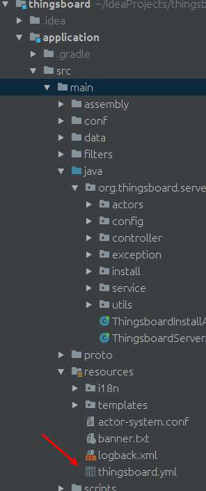

------

```
摘要: 由本人实际的搭建过程并截图输出此文档！谢谢！
```


<!-- more -->

- [依赖工具](#依赖工具)


------

# 依赖工具

- JDK

  

  ```
  note: 在终端下分别输入java， javac， javadoc。终端都显示内容，才能说明JDK安装成功
  ```

- Maven

  

  ```
  note: 更换你的maven镜像为阿里云镜像，以免导入依赖时消耗过多时间
  ```

- nodejs

  

  ```
  note: (1)node -v检测当前的操作系统的nodejs版本
  	  (2)执行ThingsBoard所需模块:npm install -g cross-env 
  	  (3)执行ThingsBoard所需模块:npm install -g webpack
  	  (4)执行ThingsBoard所需模块:npm install --global gulp
  	  (5)nodejs版本推荐6.9.x,因为过高版本可导致编译不成功.请在https://nodejs.org/dist/ 此地址下载相应安装包
  ```

- Git

  

- IntelliJ IDEA(非必须)

```
note: 请确保你在你的系统中安装了以上依赖工具，IDEA或eclipse二者随意！
```


  # 源码调试

## 源码拉取

从官方仓库 [https://github.com/thingsboard/thingsboard/](https://github.com/thingsboard/thingsboard/) 
拉取thingsboard项目，`Maven` 会下载依赖包，可能会花费一些时间，耐心等待下。

```
在git bash中输入git clone https://github.com/thingsboard/thingsboard
```


## 源码编译

在你拉取的thingsboard项目根目录下输入如下命令，如果出现下图的情况代表你已经编译成功！

```
mvn clean install –DskipTests
note: 编译时间超长，如果一次不行，那就多次，只能这么说!
```

​    

##     编译器导入

启动IDEA,打开刚刚编译好的源码项目,通过代码统计，我们可以了解到85000行代码，不要方，我们只是让它运行起来！


然后运行项目结构如下入口类:


运行结果大致如下：


唉，为什么呢？我已经编译成功了啊！为什么没有运行成功啊！因为没有数据源(也就是数据库，包括关系，非关系数据库)啊！

# 数据源处理

- 关系数据库: postgresql(推荐使用9.x版本,到此[网址](https://www.postgresql.org/ftp/source/)下载安装)

- 非关系数据库: redis

  在ThingsBoard项目中找到如下的sql文件，在postgresql中执行，安装redis。修改ThingsBoard项目中的thingsboard.yml。

  

  



# 登录ThingsBoard

用户名:sysadmin@thingsboard.org 密码为:sysadmin,进入以后 大功告成！


