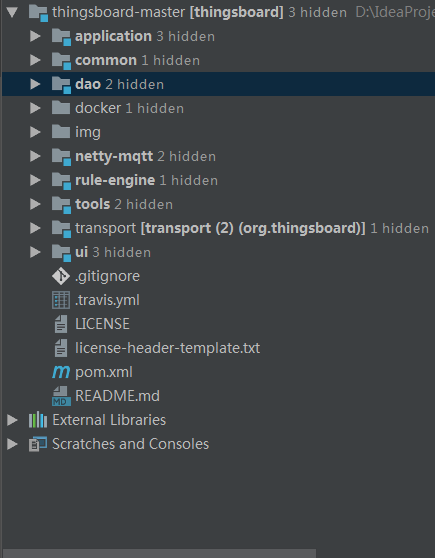
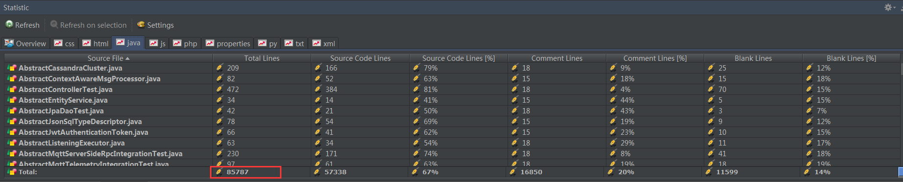
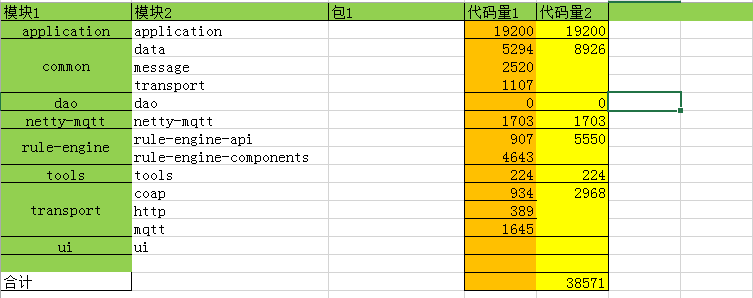
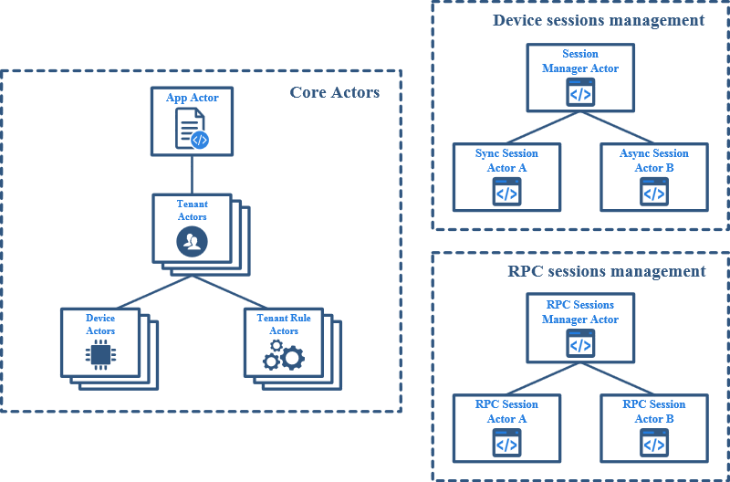
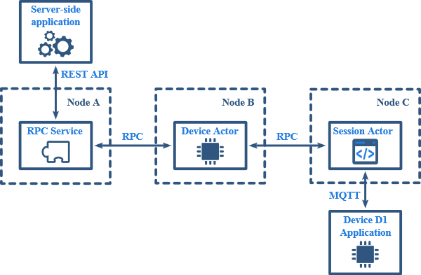

# 概述

本文主要分享开源物联网平台**ThingsBoard的项目结构**。

希望通过本文能让朋友们对thingsboard的整体项目有个简单的了解。

在拉取thingsboard项目后，我们会发现拆分了**很多**Maven项目。是不是内心一紧，产生了恐惧感?不要方，我们就是继续怼。

# 代码统计

这里先分享一个小技巧。笔者在开始源码学习时，会首先了解项目的代码量。

**第一种方式**，使用[IDEA Statistic](https://plugins.jetbrains.com/plugin/4509-statistic) 插件，统计整体代码量。

我们可以粗略的看到，总的代码量在85787行。这其中还包括单元测试，示例等等代码。所以，不慌。

第二种方式，是用[Shell脚本命令逐个Maven模块统计](https://blog.csdn.net/yhhwatl/article/details/52623879)。

一般情况下，笔者使用`find . -name "*.java"|xargs cat|grep -v -e ^$ -e ^\s*\/\/.*$|wc -l` 。这个命令只过滤了**部分注释**，所以相对[IDEA  Statistic](https://plugins.jetbrains.com/plugin/4509-statistic)会**偏多**。

当然，考虑到准确性，朋友需要手动到 `cd`到每个Maven项目的 `src/main/java` 目录下，以达到排除单元测试的代码量。

<!-- more -->

# 架构设计

ThingsBoard旨在将工作负载分布在多个节点上，而不会出现单点故障。每个ThingsBoard节点都是相同的，可以处理来自设备和服务器端应用程序的请求。

## 高级概述

------

### 设备连接

ThingsBoard支持用于设备连接的**MQTT**，**CoAP** 和 **HTTP** 协议。可以插入不同协议的支持和定制现有实现。

### 规则引擎

ThingsBoard **Rule Engine**允许处理来自设备的消息并触发称为插件的可配置处理模块。

### 核心服务

ThingsBoard包含一组允许管理以下实体的核心服务:

- 设备及其凭据
- 规则链和规则节点
- 租户和客户
- 小部件和仪表盘
- 警报和事件

规则能够调用此API的某个子集。例如，规则可以为某些设备创建警报。

### 服务器端API网关

每个ThingsBoard服务器都为注册用户提供REST API。System Telemetry服务允许使用websocket和REST API管理属性并获取时间序列数据。系统RPC服务提供REST API以自定义命令推送到设备。在此处了解有关ThingsBoard REST API的更多信息

## Actor模型

------

只要服务端API调用，Actor模型就可以从设备高性能并发处理消息。ThingsBoard使用[Akka](https://akka.io/)作为具有以下actor层次结构的actor系统实现。

下面列出了每个actor功能的简要说明:

- **App Actor**  -  负责管理租户演员。此actor的示例始终存在于内存中。
- **租户演员** -  负责管理租户设备和规则链演员。此actor的实例始终存在于内存中。
- **Device Actor** -  维护**设备**的状态:活动回话，订阅，挂起的RPC命令等。出于性能原因，将当前设备属性缓存在内存中。处理来自设备的第一条消息时，将创建一个actor。当设备在一段时间内没有消息时，actor停止。
- **规则链Actor** - 处理传入的消息，将它们保存到队列中并将它们分派给规则节点actor。此actor的实例始终存在于内存中。
- **规则节点Actor** - 处理传入消息，并将结果报告给规则链actor。此actor的实例始终存在于内存中。
- **设备会话管理器Actor** - 负责管理设备会话actor。在具有相应会话ID的第一条消息上创建会话actor。关闭相应会话时关闭会话actor。
- **Session Actor** - 表示设备和ThingsBoard服务器之间的通信会话。会话可以是同步的(HTTP,COAP)和异步的(MQTT,带有Observe选项的CoAP)。
- **RPC会话管理器Actor** - 负责管理集群RPC会话actor。新服务器启动时创建会话actor。服务器关闭时关闭会话actor。
- **RPC Session Actor** - 表示集群模式下2个ThingsBoard服务器之间的通信会话。使用基于[gPRC](https://grpc.io/)的HTTP/2进行通信。

## 集群模式

------

### 服务发现

------

ThingsBoard使用Zookeeper进行服务发现。所有ThingsBoard节点都是相同的，并在Zookeeper中注册为短暂的。Apache Curator路径缓存接受用于跟踪所有可用的兄弟节点。

### 一致的哈希

------

ThingsBoard采用[一致的散列](https://dzone.com/articles/simple-magic-consistent)来确保可扩展性和可用性。可以基于设备ID的散列将在特定节点上接收的来自设备A的消息转发到另一节点。虽然这会引入某些网络开销，但它允许使用确定的服务器上的相应设备actor处理来自特定设备的所有消息，这带来了以下优点： 

- 提高缓存命中率。设备属性和其他设备相关数据由特定服务器上的设备actor获取。
- 避免竞争条件。特定设备的所有消息都在确定的服务器上处理。
- 允许根据设备ID定位服务器端api调用。

下图演示了ThingsBoard如何处理对Device D1的RPC请求。在这种情况下，请求到达服务器A，但D1使用MQTT连接到服务器C.在最坏的情况下，D1 Device Actor将位于另一个显然与A或C不匹配的服务器B上。 

## 安全

------

### 传输加密

------

作为系统管理员，您可以将ThingsBoard配置为使用HTTP和s和MQTT传输的安全套接字层。目前尚不支持DTLS for CoAP。 

### 设备认证

------

ThingsBoard旨在支持多种类型的设备凭据。当前版本为所有[协议](https://thingsboard.io/docs/reference/protocols/)提供基于令牌的凭证的 支持，并支持基于X.509证书的MQTT协议凭证。有关更多详细信息，请参阅[MQTT over SSL](https://thingsboard.io/docs/user-guide/mqtt-over-ssl/)指南。 

## 第三方工具

------

ThingsBoard使用以下主要第三方项目： 

- Akka - 用于Actor系统实施
- Zookeeper - 用于服务协调
- gRPC - 用于高性能RPC
- Cassandra - 作为可扩展且可靠的数据库

# 项目依赖图

ThingsBoard的Maven项目之间主要依赖如下图:

