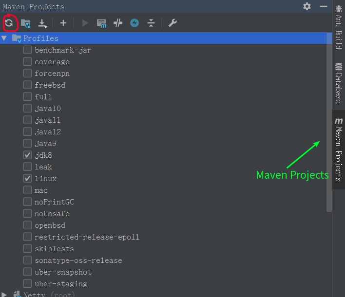
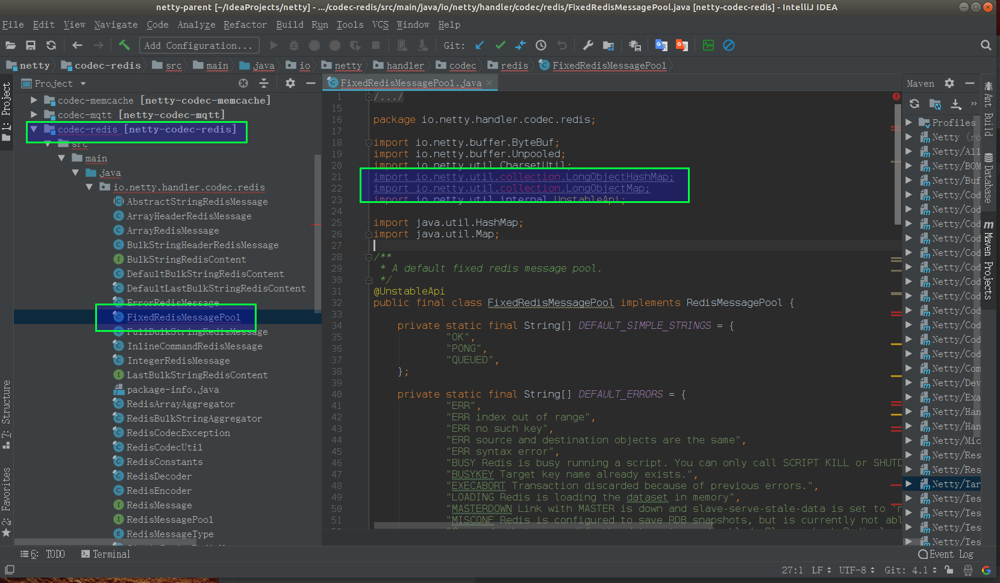
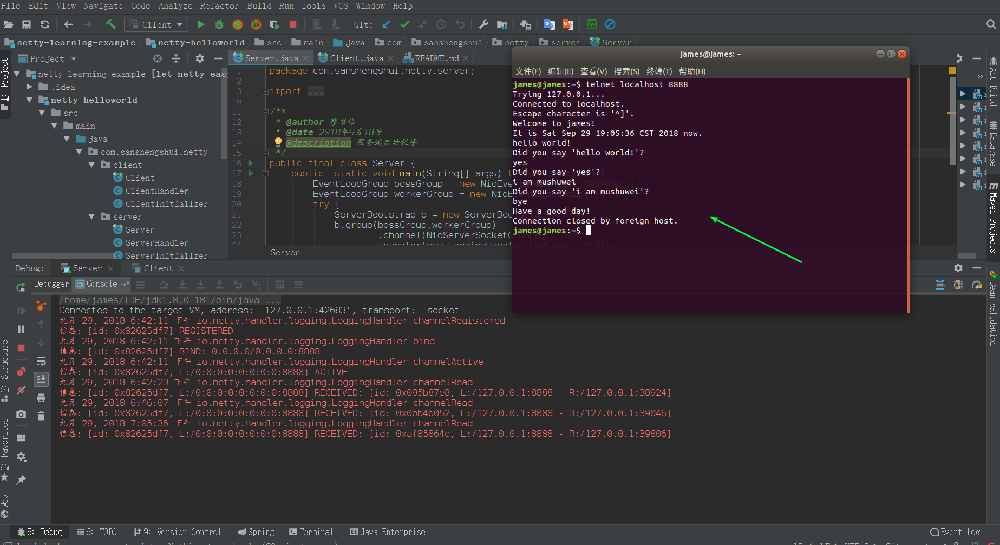

 

# 前言

Netty是 *一个异步事件驱动的网络应用程序框架，* 用于快速开发可维护的高性能协议服务器和客户端。

etty是一个NIO客户端服务器框架，可以快速轻松地开发协议服务器和客户端等网络应用程序。它极大地简化并简化了TCP和UDP套接字服务器等网络编程。

“快速简便”并不意味着最终的应用程序会受到可维护性或性能问题的影响。Netty经过精心设计，具有丰富的协议，如FTP，SMTP，HTTP以及各种二进制和基于文本的传统协议。因此，Netty成功地找到了一种在不妥协的情况下实现易于开发，性能，稳定性和灵活性的方法。

## 特征

### 设计

- 适用于各种传输类型的统一API - 阻塞和非阻塞套接字
- 基于灵活且可扩展的事件模型，可以清晰地分离关注点
- 高度可定制的线程模型 - 单线程，一个或多个线程池，如SEDA
- 真正的无连接数据报套接字支持（自3.1起）

### 使用方便

- 详细记录的Javadoc，用户指南和示例
- 没有其他依赖项，JDK 5（Netty 3.x）或6（Netty 4.x）就足够了
- 注意：某些组件（如HTTP / 2）可能有更多要求。 有关更多信息，请参阅 [“要求”页面](https://netty.io/wiki/requirements.html)。

### 性能

- 吞吐量更高，延迟更低
- 减少资源消耗
- 最小化不必要的内存复制

### 安全

- 完整的SSL / TLS和StartTLS支持

### 社区

- 早发布，经常发布
- 自2003年以来，作者一直在编写类似的框架，他仍然觉得你的反馈很珍贵！


参考链接:  https://netty.io/

<!-- more-->

# 依赖工具

- Maven
- Git
- JDK
- IntelliJ IDEA

# 源码拉取

从官方仓库 <https://github.com/netty/netty> **Fork** 出属于自己的仓库。为什么要 **Fork** ？既然开始阅读、调试源码，我们可能会写一些注释，有了自己的仓库，可以进行自由的提交。😈

使用 **IntelliJ IDEA** 从 **Fork** 出来的仓库拉取代码。

本文使用的 Netty 版本为 **4.1.26.Final-SNAPSHOT** 。

# Maven Profile

打开 IDEA 的 **Maven Projects** ，选择对应的 Profiles 。如下图所示：



 


- **jdk8** ：笔者使用的 JDK 版本是 8 ，所以勾选了 **jdk8** 。如果错误的选择，可能会报如下错误：

  ```
  java.lang.NoSuchMethodError: java.nio.ByteBuffer.clear()Ljava/nio/ByteBuffer
  ```

- **linux** : 选择对应的系统版本。😈 笔者手头没有 windows 的电脑，所以不知道该怎么选。

修改完成后，点击左上角的【刷新】按钮，进行依赖下载，耐心等待...

# 解决依赖报错

在 **codec-redis** 模块中，类 FixedRedisMessagePool 会报如下类不存在的问题：

```
import io.netty.util.collection.LongObjectHashMap;
import io.netty.util.collection.LongObjectMap;
```

- 具体如下图所示:

   


解决方式如下：

```
cd common;
mvn clean compile;
```

- 跳转到 **common** 模块中，编译生成对应的类。为什么可以通过编译生成对应的类呢，原因参见 **common** 模块的 **src/java/templates/io/netty/util/collection** 目录下的 **.template** 文件。

在 Github 上，也有多个针对这个情况讨论的 issue ：

- [《Can not find class io.netty.util.collection.LongObjectHashMap in 4.1.8.final》](https://github.com/netty/netty/issues/7518)
- [《io.netty.util.collection.LongObjectHashMap not found at branch 4.1》](https://github.com/netty/netty/issues/5447)

# example 模块

在 **example** 模块里，官网提供了多个 Netty 的使用示例。 本文以 **telnet** 包下来作为示例。哈哈哈，因为最简单且完整。

 

# [netty-helloworld](https://github.com/sanshengshui/netty-learning-example/tree/master/netty-helloworld)

**说明: 如果想直接获取工程那么可以直接跳到底部，通过链接下载工程代码。**

## 开发准备

### 环境要求

- JDK: 1.8
- Netty: 4.0或以上

如果对Netty不熟的话，可以看看之前写的一些文章。大神请无视☺。

首先还是Maven的相关依赖:

```
 <properties>
          <project.build.sourceEncoding>UTF-8</project.build.sourceEncoding>
          <project.reporting.outputEncoding>UTF-8</project.reporting.outputEncoding>
          <java.version>1.8</java.version>
          <netty-all.version>4.1.6.Final</netty-all.version>
      </properties>
  
      <dependencies>
          <dependency>
              <groupId>io.netty</groupId>
              <artifactId>netty-all</artifactId>
              <version>${netty-all.version}</version>
          </dependency>
      </dependencies>
```

 

添加了相应的maven依赖之后，配置文件这块暂时没有什么可以添加的，因为暂时就一个监听的端口而已。

## 代码编写

代码模块主要分为服务端和客户端。 主要实现的业务逻辑： 服务端启动成功之后，客户端也启动成功，这时服务端会发送一条信息给客户端。客户端或者**telnet**发送一条信息到服务端，服务端会根据逻辑回复客户端一条客户端，当客户端或者**telent**发送`bye`给服务端，服务端和客户端断开链接。

### 项目结构

```
  netty-helloworld
    ├── client
      ├── Client.class -- 客户端启动类
      ├── ClientHandler.class -- 客户端逻辑处理类
      ├── ClientHandler.class -- 客户端初始化类
    ├── server 
      ├── Server.class -- 服务端启动类
      ├── ServerHandler -- 服务端逻辑处理类
      ├── ServerInitializer -- 服务端初始化类
```

### 服务端

首先是编写服务端的启动类。

**代码如下:**

　　

```
 1   public final class Server {
 2       public  static void main(String[] args) throws Exception {
 3           //Configure the server
 4           //创建两个EventLoopGroup对象
 5           //创建boss线程组 用于服务端接受客户端的连接
 6           EventLoopGroup bossGroup = new NioEventLoopGroup(1);
 7           // 创建 worker 线程组 用于进行 SocketChannel 的数据读写
 8           EventLoopGroup workerGroup = new NioEventLoopGroup();
 9           try {
10               // 创建 ServerBootstrap 对象
11               ServerBootstrap b = new ServerBootstrap();
12               //设置使用的EventLoopGroup
13               b.group(bossGroup,workerGroup)
14                   //设置要被实例化的为 NioServerSocketChannel 类
15                       .channel(NioServerSocketChannel.class)
16                   // 设置 NioServerSocketChannel 的处理器
17                       .handler(new LoggingHandler(LogLevel.INFO))
18                    // 设置连入服务端的 Client 的 SocketChannel 的处理器
19                       .childHandler(new ServerInitializer());
20               // 绑定端口，并同步等待成功，即启动服务端
21               ChannelFuture f = b.bind(8888);
22               // 监听服务端关闭，并阻塞等待
23               f.channel().closeFuture().sync();
24           } finally {
25               // 优雅关闭两个 EventLoopGroup 对象
26               bossGroup.shutdownGracefully();
27               workerGroup.shutdownGracefully();
28           }
29       }
30 }
```

 

- 第6到8行： 创建两个EventLoopGroup对象。
  - boss 线程组: 用于服务端接受客户端的**连接**。
  - worker 线程组： 用于进行客户端的SocketChannel的**数据读写**。
  - 关于为什么是**两**个EventLoopGroup对象，请了解文章[NIO系列之Reactro模型](https://my.oschina.net/u/1859679/blog/1844109)。
- 第11行: 创建 ServerBootstrap 对象，用于设置服务端的启动配置。
  - 第13行: 调用 `#group(EventLoopGroup parentGroup, EventLoopGroup childGroup)` 方法，设置使用的 EventLoopGroup 。
  - 第15行: 调用 `#channel(Class<? extends C> channelClass)` 方法，设置要被实例化的 Channel 为 NioServerSocketChannel 类。在下文中，我们会看到该 Channel 内嵌了 `java.nio.channels.ServerSocketChannel` 对象。是不是很熟悉 😈 ？
  - 第17行: 调用 `#handler(ChannelHandler handler)` 方法，设置 NioServerSocketChannel 的处理器。在本示例中，使用了 `io.netty.handler.logging.LoggingHandler` 类，用于打印服务端的每个事件。
  - 第19行: 调用 `#childHandler(ChannelHandler handler)` 方法，设置连入服务端的 Client 的 SocketChannel 的处理器。在本实例中，使用 ServerInitializer() 来初始化连入服务端的 Client 的 SocketChannel 的处理器。
- 第21行: **先**调用 `#bind(int port)` 方法，绑定端口，**后**调用 `ChannelFuture#sync()` 方法，阻塞等待成功。这个过程，就是“**启动服务端**”。

- 第23行: **先**调用 `#closeFuture()` 方法，**监听**服务器关闭，**后**调用 `ChannelFuture#sync()` 方法，阻塞等待成功。😈 注意，此处不是关闭服务器，而是“**监听**”关闭。

- 第26到27行: 执行到此处，说明服务端已经关闭，所以调用 `EventLoopGroup#shutdownGracefully()` 方法，分别关闭两个 EventLoopGroup 对象。

 

服务端主类编写完毕之后，我们再来设置下相应的过滤条件。 这里需要继承Netty中**ChannelInitializer**类，然后重写**initChannel**该方法，进行添加相应的设置，传输协议设置，以及相应的业务实现类。 **代码如下:**

```
 1  public class ServerInitializer extends ChannelInitializer<SocketChannel> {
 2       private static final StringDecoder DECODER = new StringDecoder();
 3       private static final StringEncoder ENCODER = new StringEncoder();
 4   
 5       private static final ServerHandler SERVER_HANDLER = new ServerHandler();
 6   
 7   
 8       @Override
 9       public void initChannel(SocketChannel ch) throws Exception {
10           ChannelPipeline pipeline = ch.pipeline();
11   
12           // 添加帧限定符来防止粘包现象
13           pipeline.addLast(new DelimiterBasedFrameDecoder(8192, Delimiters.lineDelimiter()));
14           // 解码和编码，应和客户端一致
15           pipeline.addLast(DECODER);
16           pipeline.addLast(ENCODER);
17   
18           // 业务逻辑实现类
19           pipeline.addLast(SERVER_HANDLER);
20       }
21   }
```

 

服务相关的设置的代码写完之后，我们再来编写主要的业务代码。 使用Netty编写业务层的代码，我们需要继承**ChannelInboundHandlerAdapter** 或**SimpleChannelInboundHandler**类，在这里顺便说下它们两的区别吧。 继承**SimpleChannelInboundHandler**类之后，会在接收到数据后会自动**release**掉数据占用的**Bytebuffer**资源。并且继承该类需要指定数据格式。 而继承**ChannelInboundHandlerAdapter**则不会自动释放，需要手动调用**ReferenceCountUtil.release()**等方法进行释放。继承该类不需要指定数据格式。 所以在这里，个人推荐服务端继承**ChannelInboundHandlerAdapter**，手动进行释放，防止数据未处理完就自动释放了。而且服务端可能有多个客户端进行连接，并且每一个客户端请求的数据格式都不一致，这时便可以进行相应的处理。 客户端根据情况可以继承**SimpleChannelInboundHandler**类。好处是直接指定好传输的数据格式，就不需要再进行格式的转换了。

**代码如下:**

```
 1   @Sharable
 2   public class ServerHandler extends SimpleChannelInboundHandler<String> {
 3       /**
 4        * 建立连接时，发送一条庆祝消息
 5        */
 6       @Override
 7       public void channelActive(ChannelHandlerContext ctx) throws Exception {
 8           // 为新连接发送庆祝
 9           ctx.write("Welcome to " + InetAddress.getLocalHost().getHostName() + "!\r\n");
10           ctx.write("It is " + new Date() + " now.\r\n");
11           ctx.flush();
12       }
13   
14       //业务逻辑处理
15       @Override
16       public void channelRead0(ChannelHandlerContext ctx, String request) throws Exception {
17           // Generate and write a response.
18           String response;
19           boolean close = false;
20           if (request.isEmpty()) {
21               response = "Please type something.\r\n";
22           } else if ("bye".equals(request.toLowerCase())) {
23               response = "Have a good day!\r\n";
24               close = true;
25           } else {
26               response = "Did you say '" + request + "'?\r\n";
27           }
28   
29           ChannelFuture future = ctx.write(response);
30   
31           if (close) {
32               future.addListener(ChannelFutureListener.CLOSE);
33           }
34       }
35   
36       @Override
37       public void channelReadComplete(ChannelHandlerContext ctx) {
38           ctx.flush();
39       }
40   
41       //异常处理
42       @Override
43       public void exceptionCaught(ChannelHandlerContext ctx, Throwable cause) {
44           cause.printStackTrace();
45           ctx.close();
46       }
47   }
```

 

到这里服务端相应的代码就编写完毕了🚀 。

### 客户端

客户端这边的代码和服务端的很多地方都类似，我就不再过多细说了，主要将一些不同的代码拿出来简单的讲述下。 首先是客户端的主类，基本和服务端的差不多。 主要实现的代码逻辑如下:

```
public static void main(String[] args) throws Exception {
          EventLoopGroup group = new NioEventLoopGroup();
          try {
              Bootstrap b = new Bootstrap();
              b.group(group)
                      .channel(NioSocketChannel.class)
                      .handler(new ClientInitializer());
              Channel ch = b.connect("127.0.0.1",8888).sync().channel();
  
  
              ChannelFuture lastWriteFuture = null;
              BufferedReader in = new BufferedReader(new InputStreamReader(System.in));
              for (;;) {
                  String line = in.readLine();
                  if (line == null) {
                      break;
                  }
  
                  // Sends the received line to the server.
                  lastWriteFuture = ch.writeAndFlush(line + "\r\n");
  
                  // If user typed the 'bye' command, wait until the server closes
                  // the connection.
                  if ("bye".equals(line.toLowerCase())) {
                      ch.closeFuture().sync();
                      break;
                  }
              }
  
              // Wait until all messages are flushed before closing the channel.
              if (lastWriteFuture != null) {
                  lastWriteFuture.sync();
              }
          } finally {
              group.shutdownGracefully();
          }
      }
```

 

客户端过滤其这块基本和服务端一致。不过需要注意的是，传输协议、编码和解码应该一致。

**代码如下:**

```
 public class ClientInitializer extends ChannelInitializer<SocketChannel> {
      private static final StringDecoder DECODER = new StringDecoder();
      private static final StringEncoder ENCODER = new StringEncoder();
  
      private static final ClientHandler CLIENT_HANDLER = new ClientHandler();
  
  
      @Override
      public void initChannel(SocketChannel ch) {
          ChannelPipeline pipeline = ch.pipeline();
          pipeline.addLast(new DelimiterBasedFrameDecoder(8192, Delimiters.lineDelimiter()));
          pipeline.addLast(DECODER);
          pipeline.addLast(ENCODER);
  
          pipeline.addLast(CLIENT_HANDLER);
      }
  }
```

 

客户端的业务代码逻辑。

主要时打印读取到的信息。

这里有个注解， 该注解**Sharable**主要是为了多个handler可以被多个channel安全地共享，也就是保证线程安全。 废话就不多说了，代码如下：

```
 @Sharable
  public class ClientHandler extends SimpleChannelInboundHandler<String> {
      //打印读取到的数据
      @Override
      protected void channelRead0(ChannelHandlerContext ctx, String msg) throws Exception {
          System.err.println(msg);
      }
      //异常数据捕获
      @Override
      public void exceptionCaught(ChannelHandlerContext ctx, Throwable cause) {
          cause.printStackTrace();
          ctx.close();
      }
  }
  
```

 

那么到这里客户端的代码也编写完毕了🚀 。

## 功能测试

首先启动服务端，然后再启动客户端。

我们来看看结果是否如上述所说。

### 服务端输出结果:

```
 十月 02, 2018 10:03:00 上午 io.netty.handler.logging.LoggingHandler channelRegistered
  信息: [id: 0x1c7da838] REGISTERED
  十月 02, 2018 10:03:00 上午 io.netty.handler.logging.LoggingHandler bind
  信息: [id: 0x1c7da838] BIND: 0.0.0.0/0.0.0.0:8888
  十月 02, 2018 10:03:00 上午 io.netty.handler.logging.LoggingHandler channelActive
  信息: [id: 0x1c7da838, L:/0:0:0:0:0:0:0:0:8888] ACTIVE
  十月 02, 2018 10:03:51 上午 io.netty.handler.logging.LoggingHandler channelRead
  信息: [id: 0x1c7da838, L:/0:0:0:0:0:0:0:0:8888] RECEIVED: [id: 0xc033aea8, L:/127.0.0.1:8888 - R:/127.0.0.1:58178]
```

 

### 客户端输入结果:

```
Connected to the target VM, address: '127.0.0.1:37175', transport: 'socket'
  Welcome to james!
  It is Tue Oct 02 10:03:51 CST 2018 now.
  yes
  Did you say 'yes'?
  hello world
  Did you say 'hello world'?
  bye
  Have a good day!
  Disconnected from the target VM, address: '127.0.0.1:37175', transport: 'socket'
  
  Process finished with exit code 0
```

 

telnet客户端 和服务端交互结果如下:

 

通过打印信息可以看出如上述所说。

## 其它

关于netty 之 telnet HelloWorld 详解到这里就结束了。

netty 之 telnet HelloWorld 详解项目工程地址: <https://github.com/sanshengshui/netty-learning-example/tree/master/netty-helloworld>

对了，也有不使用springBoot整合的Netty项目工程地址: <https://github.com/sanshengshui/netty-learning-example>

原创不易，如果感觉不错，希望给个推荐！您的支持是我写作的最大动力！

版权声明:

 作者：穆书伟 博客园出处：<https://www.cnblogs.com/sanshengshui> 

github出处：<https://github.com/sanshengshui>　　　　 

个人博客出处：<https://sanshengshui.github.io/>