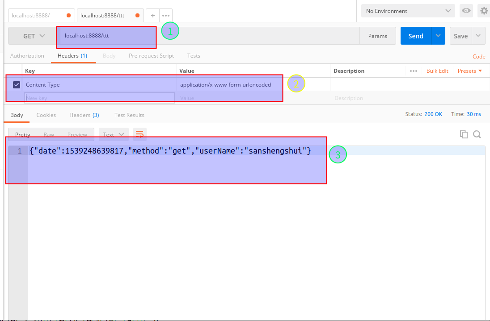

------


# 浅谈HTTP Method

要通过netty实现HTTP服务器(或者客户端)，首先你要了解HTTP协议。

HTTP在客户端 - 服务器计算模型中用作**请求 - 响应**协议。 

例如，web浏览器可以是客户端，并且在托管网站的计算机上运行的应用程序可以是服务器。 客户端向服务器提交HTTP请求消息。 

服务器提供诸如HTML文件和其他内容之类的资源，或代表客户端执行其他功能，向客户端返回响应消息。 响应包含有关请求的完成状态信息，并且还可以在其消息正文中包含所请求的内容。


## 什么是HTTP方法?

有写过网页表单的人一定对GET与POST不陌生，但你了解什么是**GET**与**POST**吗!?现今的网页设计工具相当的发达，甚至不需要接触HTML语法就能完成一个规模不小的网站，渐渐地很多人都忘记了HTTP底层的实作原理，造成在发生错误的情况下无法正确进行侦错。

早期在撰写HTML 表单语法时，都会写到以下的写法，然而大部分的软件工程师都会采用POST 进行表单传送。

```html
<form action="" method="POST/GET">
</form>
```

然而在我们的网页程序中要获取表单的变数只需要调用系统已经封装好的方法即可，像是PHP使用$_REQUEST、JAVA使用getParameter()、ASP使用Request.Form()这些方法等等。
由上述的方法看来，似乎用POST或GET好像不是很重要。许多Web工程师对于表单method用法的记忆为"POST可以传送比较多的资料"、"表单传送档案的时候要使用POST"、"POST比GET安全"等等奇怪的概念。

其实使用POST 或GET 其实是有差别的，我们先说明一下HTTP Method，在HTTP 1.1 的版本中定义了八种Method (方法)，如下所示：

- OPTIONS
- GET
- HEAD
- POST
- PUT
- DELETE
- TRACE
- CONNECT

天阿！这些方法看起来真是陌生。而我们使用的表单只用了其中两个方法(GET/POST)，其他的方法确实很少用到，但是在RESTful 的设计架构中就会使用到更多的Method 来简化设计。

<!-- more-->

## GET与POST方法

先举个例子，如果HTTP 代表现在我们现实生活中寄信的机制。

🔈那么信封的撰写格式就是HTTP。我们姑且将信封外的内容称为http-header，信封内的书信称为message-body，那么HTTP Method 就是你要告诉邮差的寄信规则。

假设GET 表示信封内不得装信件的寄送方式，如同是明信片一样，你可以把要传递的资讯写在信封(http-header)上，写满为止，价格比较便宜。然而POST 就是信封内有装信件的寄送方式（信封有内容物），不但信封可以写东西，信封内(message-body) 还可以置入你想要寄送的资料或档案，价格较贵。

使用GET 的时候我们直接将要传送的资料以Query String（一种Key/Vaule的编码方式）加在我们要寄送的地址(URL)后面，然后交给邮差传送。

使用POST 的时候则是将寄送地址(URL)写在信封上，另外将要传送的资料写在另一张信纸后，将信纸放到信封里面，交给邮差传送。

### GET方法

接着我来介绍一下实际的运作情况：

我们先来看看GET 怎么传送资料的，当我们送出一个GET 表单时，如下范例：

```
<form method="get" action="">
<input type="text" name="id" />
<input type="submit" />
</form>
```

当表单Submit 之后浏览器的网址就变成"http://xxx.toright.com/?id=010101"，浏览器会自动将表单内容转为Query String 加在URL 进行连线。

这时后来看一下HTTP Request 封包的内容：

```
GET /?id=010101 HTTP/1.1
Host: xxx.toright.com
User-Agent: Mozilla/5.0 (Windows; U; Windows NT 5.1; zh-TW; rv:1.9.2.13) Gecko/20101203 Firefox/3.6.13 GTB7.1 ( .NET CLR 3.5.30729)
Accept: text/html,application/xhtml+xml,application/xml;q=0.9,*/*;q=0.8
Accept-Language: zh-tw,en-us;q=0.7,en;q=0.3
Accept-Encoding: gzip,deflate
Accept-Charset: UTF-8,*
Keep-Alive: 115
Connection: keep-alive
```

在HTTP GET Method 中是不允许在message-body 中传递资料的，因为是GET 嘛，就是要取资料的意思。

从浏览器的网址列就可以看见我们表单要传送的资料，若是要传送密码岂不是"一览无遗".......这就是大家常提到安全性问题。

### POST方法

再来看看POST 传送资料

```
<form method="post" action="">
<input type="text" name="id" />
<input type="submit" />
</form>
```

网址列没有变化，那我们来看一下HTTP Request 封包的内容：

```
POST / HTTP/1.1
Host: xxx.toright.com
User-Agent: Mozilla/5.0 (Windows; U; Windows NT 5.1; zh-TW; rv:1.9.2.13) Gecko/20101203 Firefox/3.6.13 GTB7.1 ( .NET CLR 3.5.30729)
Accept: text/html,application/xhtml+xml,application/xml;q=0.9,*/*;q=0.8
Accept-Language: zh-tw,en-us;q=0.7,en;q=0.3
Accept-Encoding: gzip,deflate
Accept-Charset: UTF-8,*
Keep-Alive: 115
Connection: keep-alive
 
Content-Type: application/x-www-form-urlencoded
</code><code>Content-Length: 9
id=020202
```

看出个所以然了吗？原来POST 是将表单资料放在message-body 进行传送，在不偷看封包的情况下似乎安全一些些.......💛 。此外在传送档案的时候会使用到multi-part 编码，将档案与其他的表单栏位一并放在message-body 中进行传送。这就是GET 与POST 发送表单的差异啰。


# Netty HTTP编解码

要通过 Netty 处理 HTTP 请求，需要先进行编解码。


## NettyHTTP编解码器

```
public class HttpHelloWorldServerInitializer extends ChannelInitializer<SocketChannel> {
    @Override
    public void initChannel(SocketChannel ch) {
        ChannelPipeline p = ch.pipeline();
        /**
         * 或者使用HttpRequestDecoder & HttpResponseEncoder
         */
        p.addLast(new HttpServerCodec());
        /**
         * 在处理POST消息体时需要加上
         */
        p.addLast(new HttpObjectAggregator(1024*1024));
        p.addLast(new HttpServerExpectContinueHandler());
        p.addLast(new HttpHelloWorldServerHandler());
    }
}
```

- 第 8 行：调用**#new HttpServerCodec()**方法，编解码器支持部分 HTTP 请求解析，比如 HTTP GET请求所传递的参数是包含在 uri 中的，因此通过 HttpRequest 既能解析出请求参数。
  - **HttpRequestDecoder** 即把 ByteBuf 解码到 HttpRequest 和 HttpContent。
  - **HttpResponseEncoder** 即把 HttpResponse 或 HttpContent 编码到 ByteBuf。
  - **HttpServerCodec** 即 HttpRequestDecoder 和 HttpResponseEncoder 的结合。


但是，对于 HTTP POST 请求，参数信息是放在 message body 中的（对应于 netty 来说就是 HttpMessage），所以以上编解码器并不能完全解析 HTTP POST请求。

这种情况该怎么办呢？别慌，netty 提供了一个 handler 来处理。

- 第 12 行：调用**#new HttpObjectAggregator(1024*1024)**方法,即通过它可以把 HttpMessage 和 HttpContent 聚合成一个 FullHttpRequest 或者 FullHttpResponse （取决于是处理请求还是响应），而且它还可以帮助你在解码时忽略是否为“块”传输方式。

  因此，在解析 HTTP POST 请求时，请务必在 ChannelPipeline 中加上 HttpObjectAggregator。（具体细节请自行查阅代码）

- 第13行: 这个方法的作用是: http 100-continue用于客户端在发送POST数据给服务器前，征询服务器情况，看服务器是否处理POST的数据，如果不处理，客户端则不上传POST数据，如果处理，则POST上传数据。在现实应用中，通过在POST大数据时，才会使用100-continue协议


# HTTP 响应消息的实现

我们把 Java 对象根据HTTP协议封装成二进制数据包的过程成为编码，而把从二进制数据包中解析出 Java 对象的过程成为解码，在学习如何使用 Netty 进行HTTP协议的编解码之前，我们先来定义一下客户端与服务端通信的 Java 对象。


### Java 对象

我们如下定义通信过程中的 Java 对象

```
@Data
public class User {
    private String userName;

    private String method;

    private Date date;
}
```

1. 以上是通信过程中 Java 对象的抽象类，可以看到，我们定义了一个用户名（默认值为 sanshengshui ）以及一个http请求的方法和当前时间日期。
2. **@Data** 注解由 [lombok](https://www.projectlombok.org/) 提供，它会自动帮我们生产 getter/setter 方法，减少大量重复代码，推荐使用

Java 对象定义完成之后，接下来我们就需要定义一种规则，如何把一个 Java 对象转换成二进制数据，这个规则叫做 Java 对象的序列化。


### 序列化

我们如下定义序列化接口

```
/**
 * 序列化接口类
 */
public interface Serializer {
    /**
     * java 对象转换成二进制
     */
    byte[] serialize(Object object);

    /**
     * 二进制转换成 java 对象
     */
    <T> T deserialize(Class<T> clazz, byte[] bytes);
}
```

序列化接口有二个方法，serialize() 将 Java 对象转换成字节数组，deserialize() 将字节数组转换成某种类型的 Java 对象，在工程中，我们使用最简单的 json 序列化方式，使用阿里巴巴的 [fastjson](https://github.com/alibaba/fastjson) 作为序列化框架。

```
public class JSONSerializer implements Serializer {
    @Override
    public byte[] serialize(Object object) {
        return JSON.toJSONBytes(object);
    }

    @Override
    public <T> T deserialize(Class<T> clazz, byte[] bytes) {
        return JSON.parseObject(bytes,clazz);
    }
}
```

### 编码

```
		User user = new User();
        user.setUserName("sanshengshui");
        user.setDate(new Date());
        user.setMethod("get");
        JSONSerializer jsonSerializer = new JSONSerializer();
        //将Java对象序列化成为二级制数据包
        byte[] content = jsonSerializer.serialize(user);
        FullHttpResponse response = new DefaultFullHttpResponse(HTTP_1_1, OK, Unpooled.wrappedBuffer(content));
        response.headers().set(CONTENT_TYPE, "text/plain");
        response.headers().setInt(CONTENT_LENGTH, response.content().readableBytes());

        boolean keepAlive = HttpUtil.isKeepAlive(request);
        if (!keepAlive) {
            ctx.write(response).addListener(ChannelFutureListener.CLOSE);
           } else {
            response.headers().set(CONNECTION, KEEP_ALIVE);
            ctx.write(response);
           }
```


# HTTP GET解析实践

上面提到过，HTTP GET 请求的参数是包含在 uri 中的，可通过以下方式解析出 uri：

```
HttpRequest request = (HttpRequest) msg;
String uri = request.uri();
```

特别注意的是，用浏览器发起 HTTP 请求时，常常会被 uri = "/favicon.ico" 所干扰，因此最好对其特殊处理：

```
if(uri.equals(FAVICON_ICO)){
    return;
}
```

接下来就是解析 uri 了。这里需要用到 **QueryStringDecoder**：

```
Splits an HTTP query string into a path string and key-value parameter pairs.
This decoder is for one time use only.  Create a new instance for each URI:
 
QueryStringDecoder decoder = new QueryStringDecoder("/hello?recipient=world&x=1;y=2");
assert decoder.getPath().equals("/hello");
assert decoder.getParameters().get("recipient").get(0).equals("world");
assert decoder.getParameters().get("x").get(0).equals("1");
assert decoder.getParameters().get("y").get(0).equals("2");
 
This decoder can also decode the content of an HTTP POST request whose
content type is application/x-www-form-urlencoded:
 
QueryStringDecoder decoder = new QueryStringDecoder("recipient=world&x=1;y=2", false);
```

> 从上面的描述可以看出，QueryStringDecoder 的作用就是把 HTTP uri 分割成 path 和 key-value 参数对，也可以用来解码 Content-Type = "application/x-www-form-urlencoded" 的 HTTP POST。特别注意的是，该 decoder 仅能使用一次。

解析代码如下：

```
String uri = request.uri();
HttpMethod method = request.method();
if(method.equals(HttpMethod.GET)){
　　QueryStringDecoder queryDecoder = new QueryStringDecoder(uri, Charsets.toCharset(CharEncoding.UTF_8));
　　Map<String, List<String>> uriAttributes = queryDecoder.parameters();
　　//此处仅打印请求参数（你可以根据业务需求自定义处理）
　　for (Map.Entry<String, List<String>> attr : uriAttributes.entrySet()) {
　　　　for (String attrVal : attr.getValue()) {
　　　　　　System.out.println(attr.getKey() + "=" + attrVal);
　　　　}
　　}
}
```


# **HTTP POST 解析实践**

如之前所说的那样，解析 HTTP POST 请求的 message body，一定要使用 HttpObjectAggregator。但是，是否一定要把 msg 转换成 FullHttpRequest 呢？答案是否定的，且往下看。

首先解释下 FullHttpRequest 是什么：

```
Combinate the HttpRequest and FullHttpMessage, so the request is a complete HTTP request.
```

即 FullHttpRequest 包含了 HttpRequest 和 FullHttpMessage，是一个 HTTP 请求的完全体。

而把 msg 转换成 FullHttpRequest 的方法很简单：

```
FullHttpRequest fullRequest = (FullHttpRequest) msg;
```

接下来就是分几种 Content-Type 进行解析了。

```
private void dealWithContentType() throws Exception{
        String contentType = getContentType();
        //可以使用HttpJsonDecoder
        if(contentType.equals("application/json")){
            String jsonStr = fullRequest.content().toString(Charsets.toCharset(CharEncoding.UTF_8));
            JSONObject obj = JSON.parseObject(jsonStr);
            for(Map.Entry<String, Object> item : obj.entrySet()){
                logger.info(item.getKey()+"="+item.getValue().toString());
            }

        }else if(contentType.equals("application/x-www-form-urlencoded")){
            //方式一：使用 QueryStringDecoder
			String jsonStr = fullRequest.content().toString(Charsets.toCharset(CharEncoding.UTF_8));
			QueryStringDecoder queryDecoder = new QueryStringDecoder(jsonStr, false);
			Map<String, List<String>> uriAttributes = queryDecoder.parameters();
            for (Map.Entry<String, List<String>> attr : uriAttributes.entrySet()) {
                for (String attrVal : attr.getValue()) {
                    logger.info(attr.getKey() + "=" + attrVal);
                }
            }

        }else if(contentType.equals("multipart/form-data")){
            //TODO 用于文件上传
        }else{
            //do nothing...
        }
    }
    private String getContentType(){
        String typeStr = headers.get("Content-Type").toString();
        String[] list = typeStr.split(";");
        return list[0];
    }
```


# 功能测试

我是利用[Postman](https://www.getpostman.com/)对netty实现的http服务器进行请求,大家如果觉的可以的话，可以自行下载。

## Get 请求

**Postman:**



**Server:**

```
16:58:59.130 [nioEventLoopGroup-3-1] DEBUG io.netty.util.Recycler - -Dio.netty.recycler.maxSharedCapacityFactor: 2
16:58:59.130 [nioEventLoopGroup-3-1] DEBUG io.netty.util.Recycler - -Dio.netty.recycler.linkCapacity: 16
16:58:59.130 [nioEventLoopGroup-3-1] DEBUG io.netty.util.Recycler - -Dio.netty.recycler.ratio: 8
//打印请求url
16:58:59.159 [nioEventLoopGroup-3-1] INFO com.sanshengshui.netty.HttpHelloWorldServerHandler - http uri: /
```


## Post 请求

**Postman:**


**Server:**

```
16:58:59.130 [nioEventLoopGroup-3-1] DEBUG io.netty.util.Recycler - -Dio.netty.recycler.maxSharedCapacityFactor: 2
16:58:59.130 [nioEventLoopGroup-3-1] DEBUG io.netty.util.Recycler - -Dio.netty.recycler.linkCapacity: 16
16:58:59.130 [nioEventLoopGroup-3-1] DEBUG io.netty.util.Recycler - -Dio.netty.recycler.ratio: 8
16:58:59.159 [nioEventLoopGroup-3-1] INFO com.sanshengshui.netty.HttpHelloWorldServerHandler - http uri: /
17:03:59.813 [nioEventLoopGroup-2-1] INFO io.netty.handler.logging.LoggingHandler - [id: 0x0f3f5fdd, L:/0:0:0:0:0:0:0:0:8888] READ: [id: 0xfd00cb1b, L:/0:0:0:0:0:0:0:1:8888 - R:/0:0:0:0:0:0:0:1:45768]
17:03:59.813 [nioEventLoopGroup-2-1] INFO io.netty.handler.logging.LoggingHandler - [id: 0x0f3f5fdd, L:/0:0:0:0:0:0:0:0:8888] READ COMPLETE
//打印post请求的url
17:03:59.817 [nioEventLoopGroup-3-2] INFO com.sanshengshui.netty.HttpHelloWorldServerHandler - http uri: /ttt
```


# Gatling性能，负载测试

如果对Gatling测试工具不太熟悉的话，可以看一下我之前写的文章:

1. [负载，性能测试工具-Gatling](https://www.cnblogs.com/sanshengshui/p/9747069.html)
2. [Gatling简单测试SpringBoot工程](https://www.cnblogs.com/sanshengshui/p/9750478.html)

性能测试报告大体如下:

```
================================================================================
---- Global Information --------------------------------------------------------
> request count                                    1178179 (OK=1178179 KO=0     )
> min response time                                      0 (OK=0      KO=-     )
> max response time                                  12547 (OK=12547  KO=-     )
> mean response time                                     1 (OK=1      KO=-     )
> std deviation                                         32 (OK=32     KO=-     )
> response time 50th percentile                          0 (OK=0      KO=-     )
> response time 75th percentile                          1 (OK=1      KO=-     )
> response time 95th percentile                          2 (OK=2      KO=-     )
> response time 99th percentile                          5 (OK=5      KO=-     )
> mean requests/sec                                10808.982 (OK=10808.982 KO=-     )
---- Response Time Distribution ------------------------------------------------
> t < 800 ms                                       1178139 (100%)
> 800 ms < t < 1200 ms                                   0 (  0%)
> t > 1200 ms                                           40 (  0%)
> failed                                                 0 (  0%)
================================================================================
```


# 其他

关于Netty实现高性能的HTTP服务器详解到这里就结束了。

Netty实现高性能的HTTP服务器 项目工程地址: https://github.com/sanshengshui/netty-learning-example/tree/master/netty-http

原创不易，如果感觉不错，希望给个推荐！您的支持是我写作的最大动力！

版权声明: 

作者：穆书伟 

博客园出处：<https://www.cnblogs.com/sanshengshui> 

github出处：<https://github.com/sanshengshui>　　　　 

个人博客出处：<https://sanshengshui.github.io/>