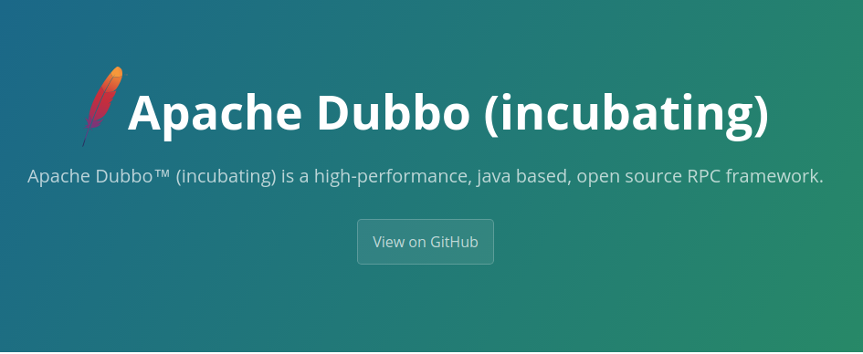
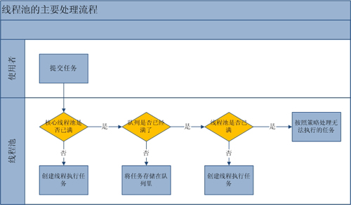
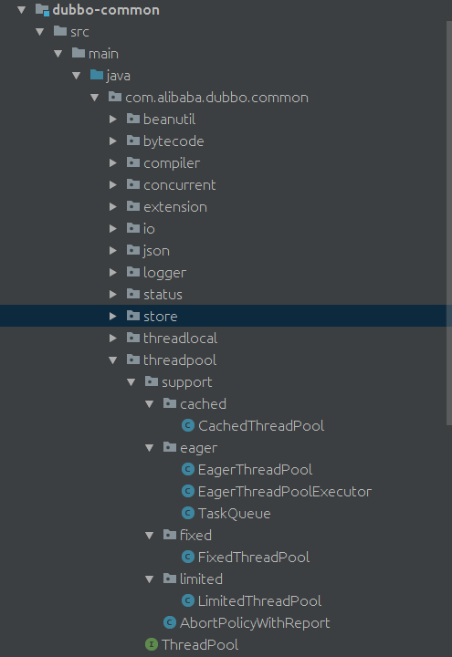

### 引言

​	合理利用线程池能够带来三个好处。

​	第一：降低资源消耗。通过重复利用已创建的线程降低线程创建和销毁造成的消耗。

​	第二：提高响应速度。当任务到达时，任务可以不需要等到线程创建就能立即执行。

​	第三：提高线程的可管理性。线程是稀缺资源，如果无限制的创建，不仅会消耗系统资源，还会降低系统的稳定性，使用线程池可以进行统一的分配，调优和监控。但是要做到合理的利用线程池，必须对其原理了如执掌。




<!-- more -->

### 线程池的使用


#### 线程池的创建

​	我们可以通过ThreadPoolExecutor来创建一个线程池

```java
new  ThreadPoolExecutor(corePoolSize, maximumPoolSize, keepAliveTime, milliseconds,runnableTaskQueue, handler);
```

​	创建一个线程池需要输入几个参数:

- corePoolSize(线程池的基本大小)：当提交一个任务到线程池时，线程池会创建一个线程来执行任务，即使其他空闲的基本线程能够执行新任务也会创建线程，等到需要执行的任务数大于线程池基本大小时就不再创建。如果调用了线程池的prestartAllCoreThreads方法，线程池会提前创建并启动所有基本线程。

- runnableTaskQueue（任务队列）：用于保存等待执行的任务的阻塞队列。 可以选择以下几个阻塞队列。
  - ArrayBlockingQueue：是一个基于数组结构的有界阻塞队列，此队列按 FIFO（先进先出）原则对元素进行排序。
  - LinkedBlockingQueue：一个基于链表结构的阻塞队列，此队列按FIFO （先进先出） 排序元素，吞吐量通常要高于ArrayBlockingQueue。静态工厂方法Executors.newFixedThreadPool()使用了这个队列。
  - SynchronousQueue：一个不存储元素的阻塞队列。每个插入操作必须等到另一个线程调用移除操作，否则插入操作一直处于阻塞状态，吞吐量通常要高于LinkedBlockingQueue，静态工厂方法Executors.newCachedThreadPool使用了这个队列。
  - PriorityBlockingQueue：一个具有优先级的无限阻塞队列。

- maximumPoolSize（线程池最大大小）：线程池允许创建的最大线程数。如果队列满了，并且已创建的线程数小于最大线程数，则线程池会再创建新的线程执行任务。值得注意的是如果使用了无界的任务队列这个参数就没什么效果。

- ThreadFactory：用于设置创建线程的工厂，可以通过线程工厂给每个创建出来的线程设置更有意义的名字。

- RejectedExecutionHandler（饱和策略）：当队列和线程池都满了，说明线程池处于饱和状态，那么必须采取一种策略处理提交的新任务。这个策略默认情况下是AbortPolicy，表示无法处理新任务时抛出异常。以下是JDK1.5提供的四种策略。
  - AbortPolicy：直接抛出异常。
  - CallerRunsPolicy：只用调用者所在线程来运行任务。
  - DiscardOldestPolicy：丢弃队列里最近的一个任务，并执行当前任务。
  - DiscardPolicy：不处理，丢弃掉。
  - 当然也可以根据应用场景需要来实现RejectedExecutionHandler接口自定义策略。如记录日志或持久化不能处理的任务。

- keepAliveTime（线程活动保持时间）：线程池的工作线程空闲后，保持存活的时间。所以如果任务很多，并且每个任务执行的时间比较短，可以调大这个时间，提高线程的利用率。

- TimeUnit（线程活动保持时间的单位）：可选的单位有天（DAYS），小时（HOURS），分钟（MINUTES），毫秒(MILLISECONDS)，微秒(MICROSECONDS, 千分之一毫秒)和毫微秒(NANOSECONDS, 千分之一微秒)。

  

  #### 向线程池提交任务

  ​	我们可以使用execute提交的任务，但是execute方法没有返回值，所以无法判断任务是否被线程池执行成功。通过以下代码可知execute方法输入的任务是一个Runnable类的实例。

  ```java
  threadsPool.execute(new Runnable() {
              @Override
              public void run() {
                  // TODO Auto-generated method stub
              }
          });
  ```

  ​	我们也可以使用submit 方法来提交任务，它会返回一个future,那么我们可以通过这个future来判断任务是否执行成功，通过future的get方法来获取返回值，get方法会阻塞住直到任务完成，而使用get(long timeout, TimeUnit unit)方法则会阻塞一段时间后立即返回，这时有可能任务没有执行完。

  ```java
  Future<Object> future = executor.submit(harReturnValuetask);
  try {
       Object s = future.get();
  } catch (InterruptedException e) {
      // 处理中断异常
  } catch (ExecutionException e) {
      // 处理无法执行任务异常
  } finally {
      // 关闭线程池
      executor.shutdown();
  }
  ```


#### 	线程池的关闭

​	我们可以通过调用线程池的shutdown或shutdownNow方法来关闭线程池，它们的原理是遍历线程池中的工作线程，然后逐个调用线程的interrupt方法来中断线程，所以无法响应中断的任务可能永远无法终止。但是它们存在一定的区别，shutdownNow首先将线程池的状态设置成STOP，然后尝试停止所有的正在执行或暂停任务的线程，并返回等待执行任务的列表，而shutdown只是将线程池的状态设置成SHUTDOWN状态，然后中断所有没有正在执行任务的线程。

​	只要调用了这两个关闭方法的其中一个，isShutdown方法就会返回true。当所有的任务都已关闭后,才表示线程池关闭成功，这时调用isTerminaed方法会返回true。至于我们应该调用哪一种方法来关闭线程池，应该由提交到线程池的任务特性决定，通常调用shutdown来关闭线程池，如果任务不一定要执行完，则可以调用shutdownNow。


### 线程池的分析

​	流程分析: 线程池的主要工作流程如下图:

)


从上图我们可以看出，当提交一个新任务到线程池时，线程池的处理流程如下:

1. 首先线程池判断基本线程池是否已满？没满，创建一个工作线程来执行任务。满了，则进入下个流程。
2. 其次线程池判断工作队列是否已满？没满，则将新提交的任务存储在工作队列里。满了，则进入下个流程。
3. 最后线程池判断整个线程池是否已满？没满，则创建一个新的工作线程来执行任务，满了，则交给饱和策略来处理这个任务。

源码分析。上面的流程分析让我们很直观的了解了线程池的工作原理，让我们再通过源代码来看看是如何实现的。线程池执行任务的方法如下：

```java
public void execute(Runnable command) {
    if (command == null)
       throw new NullPointerException();
    //如果线程数小于基本线程数，则创建线程并执行当前任务 
    if (poolSize >= corePoolSize || !addIfUnderCorePoolSize(command)) {
    //如线程数大于等于基本线程数或线程创建失败，则将当前任务放到工作队列中。
        if (runState == RUNNING && workQueue.offer(command)) {
            if (runState != RUNNING || poolSize == 0)
                      ensureQueuedTaskHandled(command);
        }
    //如果线程池不处于运行中或任务无法放入队列，并且当前线程数量小于最大允许的线程数量，
则创建一个线程执行任务。
        else if (!addIfUnderMaximumPoolSize(command))
        //抛出RejectedExecutionException异常
            reject(command); // is shutdown or saturated
    }
}
```

工作线程。线程池创建线程时，会将线程封装成工作线程Worker，Worker在执行完任务后，还会无限循环获取工作队列里的任务来执行。我们可以从Worker的run方法里看到这点：

```java
public void run() {
     try {
           Runnable task = firstTask;
           firstTask = null;
            while (task != null || (task = getTask()) != null) {
                    runTask(task);
                    task = null;
            }
      } finally {
             workerDone(this);
      }
} 
```


### 合理的配置线程池

​	要想合理的配置线程池，就必须首先分析任务特性，可以从以下几个角度来进行分析：

1. 任务的性质：CPU密集型任务，IO密集型任务和混合型任务。

2. 任务的优先级：高，中和低。

3. 任务的执行时间：长，中和短。

4. 任务的依赖性：是否依赖其他系统资源，如数据库连接。

   ​	任务性质不同的任务可以用不同规模的线程池分开处理。CPU密集型任务配置尽可能小的线程，如配置Ncpu+1个线程的线程池。IO密集型任务则由于线程并不是一直在执行任务，则配置尽可能多的线程，如2*Ncpu。混合型的任务，如果可以拆分，则将其拆分成一个CPU密集型任务和一个IO密集型任务，只要这两个任务执行的时间相差不是太大，那么分解后执行的吞吐率要高于串行执行的吞吐率，如果这两个任务执行时间相差太大，则没必要进行分解。我们可以通过Runtime.getRuntime().availableProcessors()方法获得当前设备的CPU个数。

   ​	优先级不同的任务可以使用优先级队列PriorityBlockingQueue来处理。它可以让优先级高的任务先得到执行，需要注意的是如果一直有优先级高的任务提交到队列里，那么优先级低的任务可能永远不能执行。

   ​	执行时间不同的任务可以交给不同规模的线程池来处理，或者也可以使用优先级队列，让执行时间短的任务先执行。

   ​	依赖数据库连接池的任务，因为线程提交SQL后需要等待数据库返回结果，如果等待的时间越长CPU空闲时间就越长，那么线程数应该设置越大，这样才能更好的利用CPU。

   ​	建议使用有界队列，有界队列能增加系统的稳定性和预警能力，可以根据需要设大一点，比如几千。有一次我们组使用的后台任务线程池的队列和线程池全满了，不断的抛出抛弃任务的异常，通过排查发现是数据库出现了问题，导致执行SQL变得非常缓慢，因为后台任务线程池里的任务全是需要向数据库查询和插入数据的，所以导致线程池里的工作线程全部阻塞住，任务积压在线程池里。如果当时我们设置成无界队列，线程池的队列就会越来越多，有可能会撑满内存，导致整个系统不可用，而不只是后台任务出现问题。当然我们的系统所有的任务是用的单独的服务器部署的，而我们使用不同规模的线程池跑不同类型的任务，但是出现这样问题时也会影响到其他任务。

   

### 线程池的监控

通过线程池提供的参数进行监控。线程池里有一些属性在监控线程池的时候可以使用

- taskCount：线程池需要执行的任务数量。
- completedTaskCount：线程池在运行过程中已完成的任务数量。小于或等于taskCount。
- largestPoolSize：线程池曾经创建过的最大线程数量。通过这个数据可以知道线程池是否满过。如等于线程池的最大大小，则表示线程池曾经满了。
- getPoolSize:线程池的线程数量。如果线程池不销毁的话，池里的线程不会自动销毁，所以这个大小只增不+ getActiveCount：获取活动的线程数。

通过扩展线程池进行监控。通过继承线程池并重写线程池的beforeExecute，afterExecute和terminated方法，我们可以在任务执行前，执行后和线程池关闭前干一些事情。如监控任务的平均执行时间，最大执行时间和最小执行时间等。这几个方法在线程池里是空方法。如下：

```java
protected void beforeExecute(Thread t, Runnable r) { }
```


### dubbo对线程池的使用

在[dubbo-common](https://github.com/sanshengshui/dubbo/tree/master/dubbo-common) 模块的threadpool包下体现，如下图所示:




#### ThreadPool

[com.alibaba.dubbo.common.threadpool.ThreadPool](https://github.com/sanshengshui/dubbo/blob/master/dubbo-common/src/main/java/com/alibaba/dubbo/common/threadpool/ThreadPool.java) ，线程池接口。代码如下:

```java

//@SPI("fixed")注解,Dubbo SPI扩展点,默认为"fixed"。
@SPI("fixed")
public interface ThreadPool {
    /**
     * @Adaptive({Constants.THREADPOOL_KEY}) 注解,基于Dubbo SPI Adaptive机制，加载对应的线程池实现,使用URL.threadpool属性。
     * getExecutor(url)方法,获得对应的线程池的执行器
     *
     */
    @Adaptive({Constants.THREADPOOL_KEY})
    Executor getExecutor(URL url);

}
```


#### FixedThreadPool

[com.alibaba.dubbo.common.threadpool.support.fixed.FixedThreadPool](https://github.com/sanshengshui/dubbo/blob/master/dubbo-common/src/main/java/com/alibaba/dubbo/common/threadpool/support/fixed/FixedThreadPool.java) ,实现ThreadPool接口,固定大小线程池，启动时建立线程，不关闭，一直持有。代码如下:

```java
public class FixedThreadPool implements ThreadPool {

    @Override
    public Executor getExecutor(URL url) {
        //线程名
        String name = url.getParameter(Constants.THREAD_NAME_KEY, Constants.DEFAULT_THREAD_NAME);
        //线程数
        int threads = url.getParameter(Constants.THREADS_KEY, Constants.DEFAULT_THREADS);
        //队列数
        int queues = url.getParameter(Constants.QUEUES_KEY, Constants.DEFAULT_QUEUES);
        //创建执行器
        return new ThreadPoolExecutor(threads, threads, 0, TimeUnit.MILLISECONDS,
                /**
                 * 根据不同的队列数,使用不同的队列实现:
                 * queues == 0,SynchronousQueue对象。
                 * queues < 0,LinkedBlockingQueue对象。
                 * queues > 0,带队列数的LinkedBlockingQueue对象。
                 */
                queues == 0 ? new SynchronousQueue<Runnable>() :
                        (queues < 0 ? new LinkedBlockingQueue<Runnable>()
                                : new LinkedBlockingQueue<Runnable>(queues)),
                /**
                 * 创建NamedThreadFactory对象，用于生成线程名
                 * 创建AbortPolicyWithReport对象，用于当任务添加到线程池中被拒绝时。
                 */
                new NamedInternalThreadFactory(name, true), new AbortPolicyWithReport(name, url));
    }
}
```

推荐阅读：

- [《Java并发包中的同步队列SynchronousQueue实现原理》](http://ifeve.com/java-synchronousqueue/)

- [《Java阻塞队列ArrayBlockingQueue和LinkedBlockingQueue实现原理分析》](https://fangjian0423.github.io/2016/05/10/java-arrayblockingqueue-linkedblockingqueue-analysis/)

- [《聊聊并发(七) -- Java中的阻塞队列》](http://www.infoq.com/cn/articles/java-blocking-queue)

  

#### CachedThreadPool

[com.alibaba.dubbo.common.threadpool.support.cached.CachedThreadPool](https://github.com/sanshengshui/dubbo/blob/master/dubbo-common/src/main/java/com/alibaba/dubbo/common/threadpool/support/cached/CachedThreadPool.java) ,实现ThreadPool接口，缓存线程池，空闲一定时长，自动删除，需要时重建。代码如下:

```java
public class CachedThreadPool implements ThreadPool {

    @Override
    public Executor getExecutor(URL url) {
        //线程池名
        String name = url.getParameter(Constants.THREAD_NAME_KEY, Constants.DEFAULT_THREAD_NAME);
        //核心线程数
        int cores = url.getParameter(Constants.CORE_THREADS_KEY, Constants.DEFAULT_CORE_THREADS);
        //最大线程数
        int threads = url.getParameter(Constants.THREADS_KEY, Integer.MAX_VALUE);
        //队列数
        int queues = url.getParameter(Constants.QUEUES_KEY, Constants.DEFAULT_QUEUES);
        //线程存活时长
        int alive = url.getParameter(Constants.ALIVE_KEY, Constants.DEFAULT_ALIVE);
        //创建执行器
        return new ThreadPoolExecutor(cores, threads, alive, TimeUnit.MILLISECONDS,
                queues == 0 ? new SynchronousQueue<Runnable>() :
                        (queues < 0 ? new LinkedBlockingQueue<Runnable>()
                                : new LinkedBlockingQueue<Runnable>(queues)),
                new NamedInternalThreadFactory(name, true), new AbortPolicyWithReport(name, url));
    }
}
```


#### LimitedThreadPool

[com.alibaba.dubbo.common.threadpool.support.limited.LimitedThreadPool](https://github.com/sanshengshui/dubbo/blob/master/dubbo-common/src/main/java/com/alibaba/dubbo/common/threadpool/support/limited/LimitedThreadPool.java) ,实现ThreadPool接口，可伸缩线程池，但池中的线程池只会增长不会收缩。只增长不收缩的目的是为了避免收缩时突然来了大流量引起的性能问题。代码如下:

```java
public class LimitedThreadPool implements ThreadPool {

    @Override
    public Executor getExecutor(URL url) {
        //线程池名
        String name = url.getParameter(Constants.THREAD_NAME_KEY, Constants.DEFAULT_THREAD_NAME);
        //核心线程数
        int cores = url.getParameter(Constants.CORE_THREADS_KEY, Constants.DEFAULT_CORE_THREADS);
        //最大线程数
        int threads = url.getParameter(Constants.THREADS_KEY, Constants.DEFAULT_THREADS);
        //队列数
        int queues = url.getParameter(Constants.QUEUES_KEY, Constants.DEFAULT_QUEUES);
        /**
         * 和CachedThreadPool实现是基本一致的，差异点在alive == Integer.MAX_VALUE,空闲时间无限大，即不会删除。
         */
        return new ThreadPoolExecutor(cores, threads, Long.MAX_VALUE, TimeUnit.MILLISECONDS,
                queues == 0 ? new SynchronousQueue<Runnable>() :
                        (queues < 0 ? new LinkedBlockingQueue<Runnable>()
                                : new LinkedBlockingQueue<Runnable>(queues)),
                new NamedInternalThreadFactory(name, true), new AbortPolicyWithReport(name, url));
    }

}
```

#### AbortPolicyWithReport

[com.alibaba.dubbo.common.threadpool.support.AbortPolicyWithReport](https://github.com/sanshengshui/dubbo/blob/master/dubbo-common/src/main/java/com/alibaba/dubbo/common/threadpool/support/AbortPolicyWithReport.java) ,实现 java.util.concurrent.ThreadPoolExecutor.AbortPolicy,拒绝策略实现类。**打印JStack,分析线程状态** 代码如下:

```java
/**
 * AbortPolicyWithReport实现自ThreadPoolExecutor.AbortPolicy,拒绝策略实现类，
 * 打印JStack,分析线程状态。
 */
public class AbortPolicyWithReport extends ThreadPoolExecutor.AbortPolicy {


    protected static final Logger logger = LoggerFactory.getLogger(AbortPolicyWithReport.class);
    /**
     * 线程名
     */
    private final String threadName;

    /**
     * URL 对象
     */
    private final URL url;

    /**
     * 最后打印时间
     */
    private static volatile long lastPrintTime = 0;

    /**
     * 信号量，大小为1。
     */
    private static Semaphore guard = new Semaphore(1);

    public AbortPolicyWithReport(String threadName, URL url) {
        this.threadName = threadName;
        this.url = url;
    }

    @Override
    public void rejectedExecution(Runnable r, ThreadPoolExecutor e) {
        /**
         * 打印告警日志
         */
        String msg = String.format("Thread pool is EXHAUSTED!" +
                        " Thread Name: %s, Pool Size: %d (active: %d, core: %d, max: %d, largest: %d), Task: %d (completed: %d)," +
                        " Executor status:(isShutdown:%s, isTerminated:%s, isTerminating:%s), in %s://%s:%d!",
                threadName, e.getPoolSize(), e.getActiveCount(), e.getCorePoolSize(), e.getMaximumPoolSize(), e.getLargestPoolSize(),
                e.getTaskCount(), e.getCompletedTaskCount(), e.isShutdown(), e.isTerminated(), e.isTerminating(),
                url.getProtocol(), url.getIp(), url.getPort());
        logger.warn(msg);
        // 打印 JStack,分析线程状态。
        dumpJStack();
        //抛出 RejectedExecutionException 异常
        throw new RejectedExecutionException(msg);
    }

    private void dumpJStack() {
        long now = System.currentTimeMillis();
        //每 10 分钟，打印一次。
        //dump every 10 minutes
        if (now - lastPrintTime < 10 * 60 * 1000) {
            return;
        }
        //获得信号量
        if (!guard.tryAcquire()) {
            return;
        }
        //创建线程池，后台执行打印JStack
        Executors.newSingleThreadExecutor().execute(new Runnable() {
            @Override
            public void run() {
                //获得路径
                String dumpPath = url.getParameter(Constants.DUMP_DIRECTORY, System.getProperty("user.home"));

                SimpleDateFormat sdf;
                //获得系统
                String OS = System.getProperty("os.name").toLowerCase();

                // window system don't support ":" in file name
                if(OS.contains("win")){
                    sdf = new SimpleDateFormat("yyyy-MM-dd_HH-mm-ss");
                }else {
                    sdf = new SimpleDateFormat("yyyy-MM-dd_HH:mm:ss");
                }

                String dateStr = sdf.format(new Date());
                //获得输出流
                FileOutputStream jstackStream = null;
                try {
                    jstackStream = new FileOutputStream(new File(dumpPath, "Dubbo_JStack.log" + "." + dateStr));
                    //打印JStack
                    JVMUtil.jstack(jstackStream);
                } catch (Throwable t) {
                    logger.error("dump jstack error", t);
                } finally {
                    //释放信号量
                    guard.release();
                    //释放输出流
                    if (jstackStream != null) {
                        try {
                            jstackStream.flush();
                            jstackStream.close();
                        } catch (IOException e) {
                        }
                    }
                }
                //记录最后打印时间
                lastPrintTime = System.currentTimeMillis();
            }
        });

    }

}
```


推荐阅读:

- [《如何使用jstack分析线程状态》](https://www.jianshu.com/p/6690f7e92f27)
- [《控制并发线程数的Semaphore》](http://ifeve.com/concurrency-semaphore/)